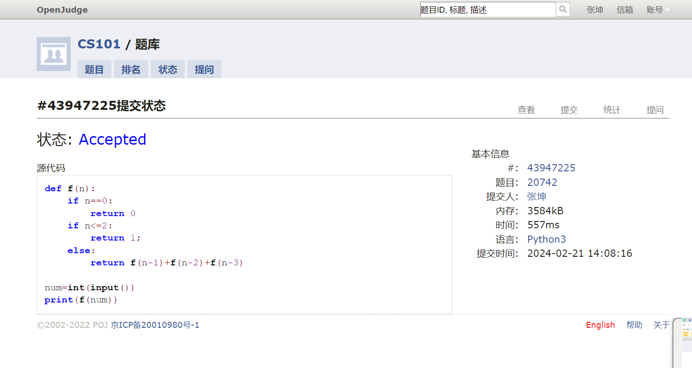
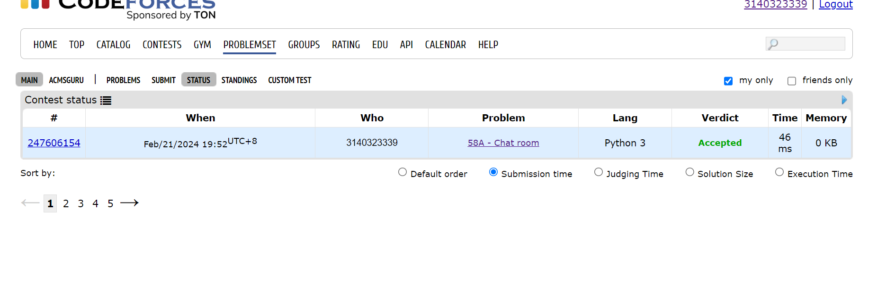
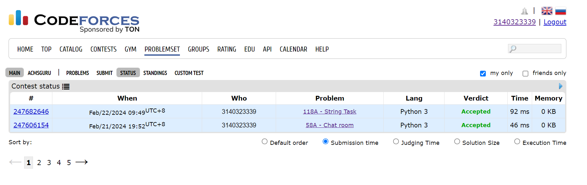
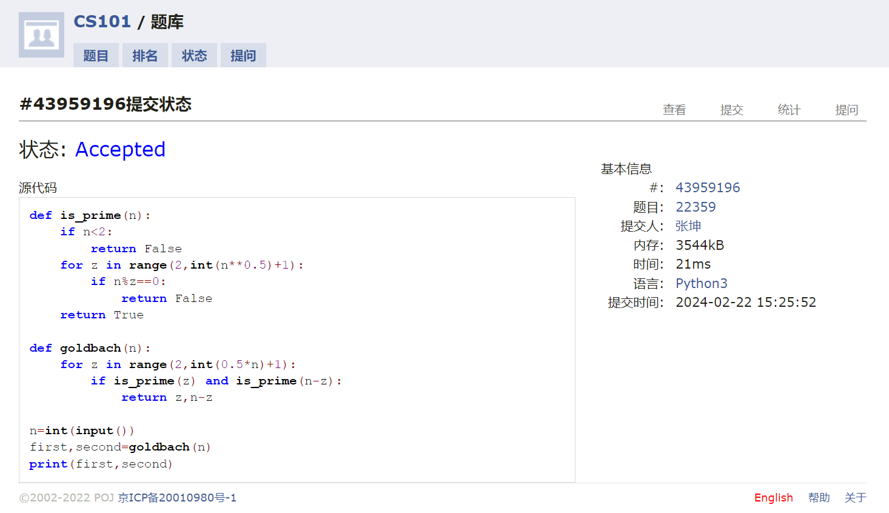
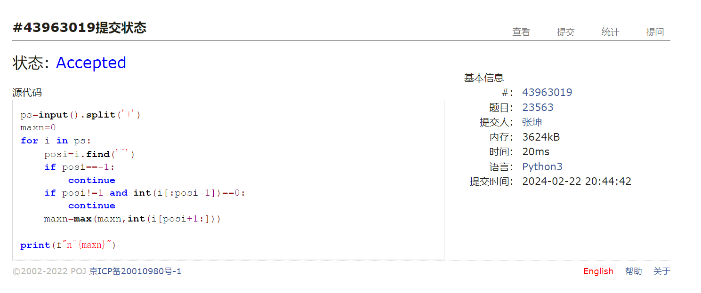
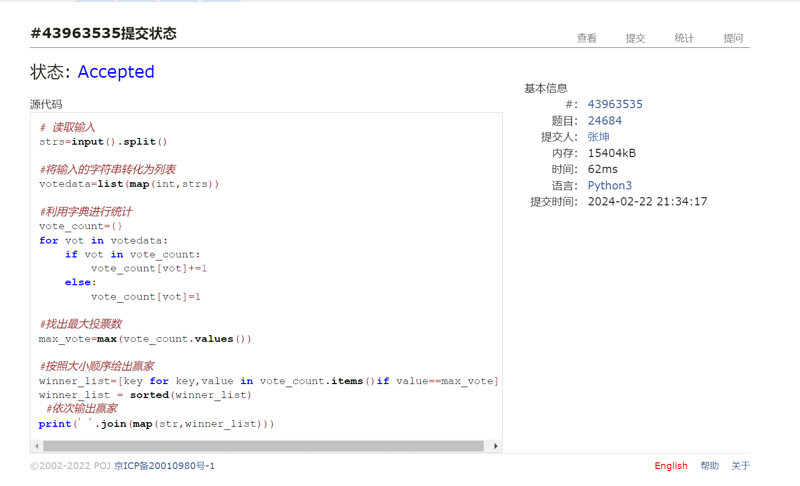

#      assignment1
2024 spring，compiled by 张坤 信科电子信息专业
## 1.题目
### 1.斐波那契数列
思路：运用递归的思路
#### 用时: 5分钟
#### 代码
```
def f(n):
    if n==0:
        return 0
    if n<=2:
        return 1;
    else:
        return f(n-1)+f(n-2)+f(n-3)

num=int(input())
print(f(num))

```



### 2.Chat room
思路： 在输入字符串中找从头往后找依次找'h''e''l''l''o'即可
#### 用时: 4分钟
#### 代码
```py
word=input()
correct='hello'
cnt=0

for c in word:
    if c==correct[cnt]:
        cnt+=1
    if cnt==5:
        break
if cnt==5:
    print('YES')
else :
    print('NO')
```


### 3.String task
思路：运用lower小写化，用not in判断是否为辅音
#### 用时：6分钟
#### 代码
```py
task=input()
word=task.lower()
output=[]
vowel=['a','e','i','u','o','y']

for char in word:
    if char not in vowel:
        output.append('.')
        output.append(char)

print(''.join(output))
```

### 4.Goldbach Conjection
思路：定义函数is_prime来判断素数，然后通过循环来搜寻满足条件的素数
#### 用时：8分钟
#### 代码
```py
def is_prime(n):
    if n<2:
        return False
    for z in range(2,int(n**0.5)+1):
        if n%z==0:
            return False
    return True

def goldbach(n):
    for z in range(2,int(0.5*n)+1):
        if is_prime(z) and is_prime(n-z):
            return z,n-z
        
n=int(input())
first,second=goldbach(n)
print(first,second)
```

### 5.多项式时间复杂度
思路：运用split对表达式进行处理，再通过切片获取需要得到的最大值
#### 用时：9分钟
#### 代码
```py
ps=input().split('+')
maxn=0
for i in ps:
    posi=i.find('^')
    if posi==-1:
        continue
    if posi!=1 and int(i[:posi-1])==0:
        continue
    maxn=max(maxn,int(i[posi+1:]))

print(f"n^{maxn}")
```

### 6.直播计票
思路：利用字典进行计数
#### 用时：10分钟
#### 代码
```py
# 读取输入
strs=input().split()

#将输入的字符串转化为列表
votedata=list(map(int,strs))

#利用字典进行统计
vote_count={}
for vot in votedata:
    if vot in vote_count:
        vote_count[vot]+=1
    else:
        vote_count[vot]=1

#找出最大投票数
max_vote=max(vote_count.values())

#按照大小顺序给出赢家
winner_list=[key for key,value in vote_count.items()if value==max_vote]
winner_list = sorted(winner_list)
 #依次输出赢家
print(' '.join(map(str,winner_list)))
```

# 2.学习与总结
本人为py新手，基础较为薄弱，练题后大有收获，如下：
## day1 2024.2.21
### 1.lower
在Python中，lower()是一个字符串方法，用于将字符串转换为小写形式。它返回一个新的字符串，其中所有的大写字母被转换为小写字母。

以下是一个示例：
```python
text = "Hello, World!"
lower_text = text.lower()
print(lower_text)
```
输出结果:
```
hello, world!
```
在上面的代码中，我们调用了字符串text的lower()方法，将所有的大写字母转换为小写字母，并将结果赋值给lower_text。然后，我们打印lower_text，输出结果为小写形式的字符串。

请注意，lower()方法只适用于字符串对象，而不适用于其他数据类型。如果尝试将非字符串对象应用于lower()方法，将会引发AttributeError。
### 2.python中的列表方法
dp = [0]*5 意为建立一个列表dp其中有5个0
### 3.字符串
python中字符串相当于一个range列表？
可以用到for _ in _ 中后一个下划线处
### 4.sum
1.可以计算数字和浮点数列表的总和
else字符串列表的连接:（用join）
```py
words = ['Hello', ' ', 'World', '!']
sentence = ''.join(words)
print(sentence)
```
------Hello World!

## day2 2024.2.22
### 1.in
```py
if char not in vowel:
```
这个条件判断语句的意思是，如果变量char不在元音字母集合中，执行下面的代码块。
假设vowel是一个包含元音字母的集合，例如vowel = {'a', 'e', 'i', 'o', 'u'}。
所以，如果char不在vowel集合中，就会执行下面的代码块。
#### 用法
在Python中，in是一个用于成员运算的关键字。它用于检查一个值是否存在于一个容器（例如列表、元组、字符串、集合或字典）中。
### 2.**
n**0.5即n的零点五次方
**用于计算幂运算
### 3.and与or
and==&& or==||
### 4. input
默认input() 函数返回的是一个字符串类型。
### 5.
```py
ps = input().split('+') 
ns = [(i.split('n^')) for i in ps] 
```
ps输入的结果实际上是一个列表，多项式中的每一项就是其中一个元素
而ns是新建一个列表，从ps的每一个元素依次放入，并且再列表分割化，即是二重嵌套列表
### 6.
```py
 pos = i.find('^')
 ```
 find函数查找位置，即在i中查找^的位置，找不到则返回值为-1（注意 第一个位置的返回值为0）
 ### 7.：的切片用法
 i[:pos-1] 表示从开头到 pos-1 的位置索引的子字符串。
 i[pos-1:] 表示从字符串 i 的 pos-1 位置索引开始到字符串末尾的部分。
 ### 8.字典与列表
 使用 vote_count = {} 表示创建一个空字典，用于存储选项和对应的得票数。字典是一种无序的数据结构，其中每个元素由一个键和一个值组成，可以通过键来访问对应的值。

而使用 vote_count = [] 表示创建一个空列表，用于存储得票数。列表是一种有序的数据结构，可以按照索引位置来访问和操作其中的元素。
### 9.map
map(int,input_str.split())的返回值是可迭代对象
必须要通过list（）才能转化为列表
### 10.join
join() 函数需要将列表中的元素连接成一个字符串。因此，您需要将 winner_list 中的整数元素转换为字符串类型。

