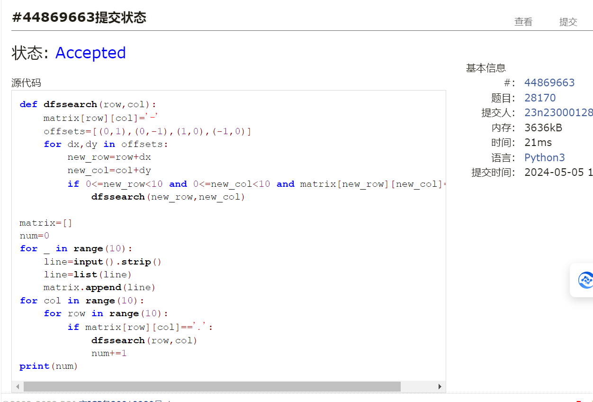
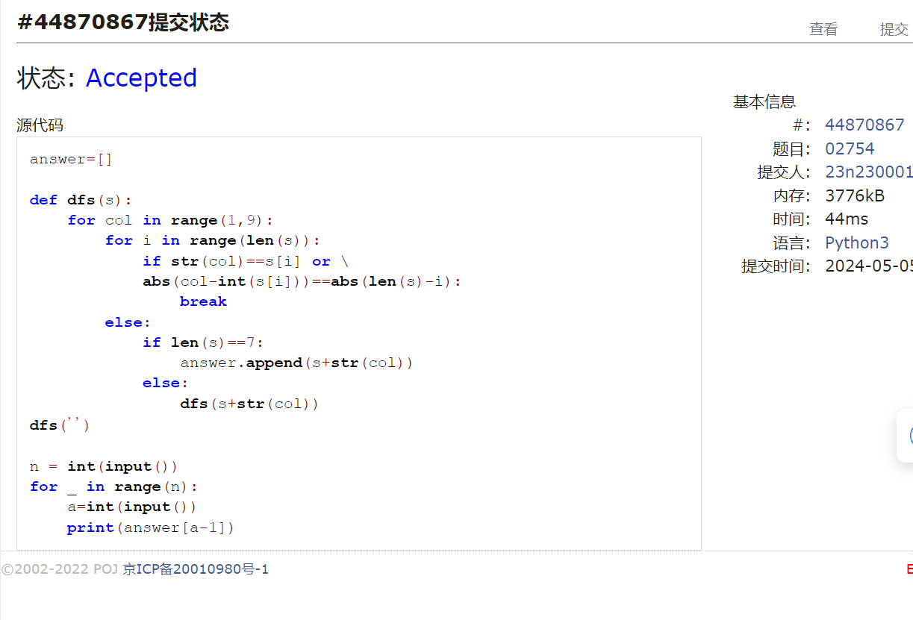
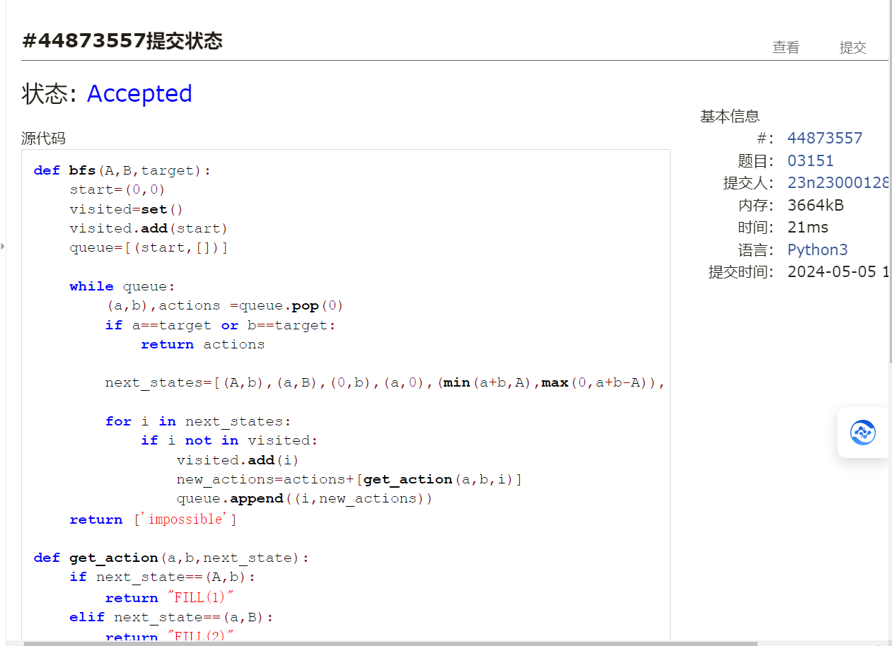
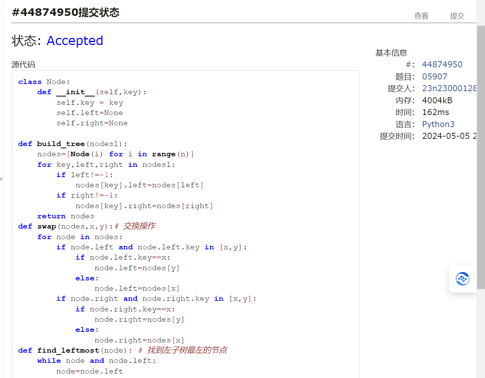
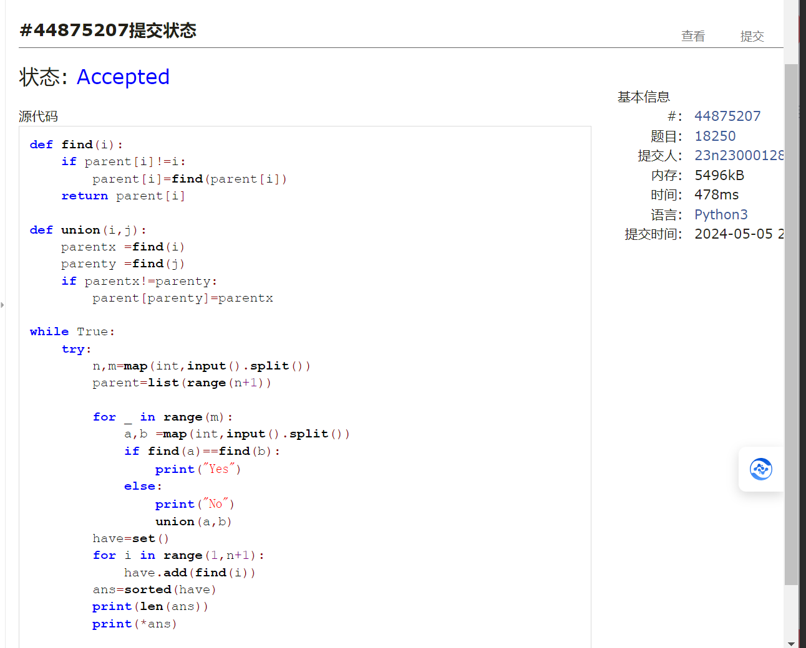
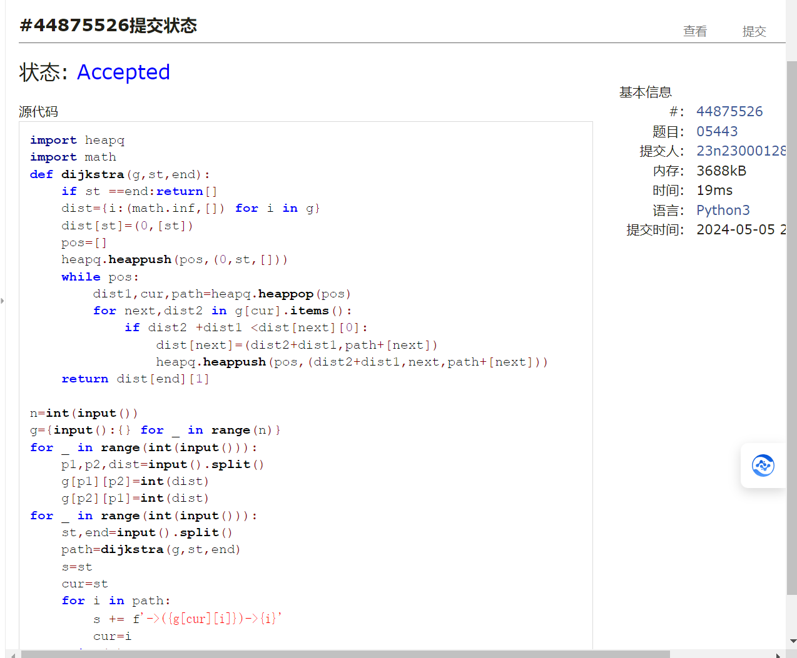

# Assignment #B: 图论和树算

Updated 1709 GMT+8 Apr 28, 2024

2024 spring, Complied by ==张坤 信科==


**说明：**

1）请把每个题目解题思路（可选），源码Python, 或者C++（已经在Codeforces/Openjudge上AC），截图（包含Accepted），填写到下面作业模版中（推荐使用 typora https://typoraio.cn ，或者用word）。AC 或者没有AC，都请标上每个题目大致花费时间。

2）提交时候先提交pdf文件，再把md或者doc文件上传到右侧“作业评论”。Canvas需要有同学清晰头像、提交文件有pdf、"作业评论"区有上传的md或者doc附件。

3）如果不能在截止前提交作业，请写明原因。


**编程环境**


## 1. 题目

### 28170: 算鹰

dfs, http://cs101.openjudge.cn/practice/28170/


思路：简单的dfs，注意边界条件


代码

```python
def dfssearch(row,col):
    matrix[row][col]='-'
    offsets=[(0,1),(0,-1),(1,0),(-1,0)]
    for dx,dy in offsets:
        new_row=row+dx
        new_col=col+dy
        if 0<=new_row<10 and 0<=new_col<10 and matrix[new_row][new_col]=='.':
            dfssearch(new_row,new_col)
            
matrix=[]
num=0
for _ in range(10):
    line=input().strip()
    line=list(line)
    matrix.append(line)
for col in range(10):
    for row in range(10):
        if matrix[row][col]=='.':
            dfssearch(row,col)
            num+=1
print(num)

```



代码运行截图 ==（至少包含有"Accepted"）==


### 02754: 八皇后

dfs, http://cs101.openjudge.cn/practice/02754/


思路：将棋盘简化为数学问题，运用数学即可判定斜线上冲突，横纵坐标冲突，


代码

```python
answer=[]

def dfs(s):
    for col in range(1,9):
        for i in range(len(s)):
            if str(col)==s[i] or \
            abs(col-int(s[i]))==abs(len(s)-i):
                break
        else:
            if len(s)==7:
                answer.append(s+str(col))
            else:
                dfs(s+str(col))
dfs('')

n = int(input())
for _ in range(n):
    a=int(input())
    print(answer[a-1])

```



代码运行截图 ==（至少包含有"Accepted"）==


### 03151: Pots

bfs, http://cs101.openjudge.cn/practice/03151/


思路：bfs


代码

```python
def bfs(A,B,target):
    start=(0,0)
    visited=set()
    visited.add(start)
    queue=[(start,[])]
    
    while queue:
        (a,b),actions =queue.pop(0)
        if a==target or b==target:
            return actions
        
        next_states=[(A,b),(a,B),(0,b),(a,0),(min(a+b,A),max(0,a+b-A)),(max(0,a+b-B),min(B,a+b))]
        
        for i in next_states:
            if i not in visited:
                visited.add(i)
                new_actions=actions+[get_action(a,b,i)]
                queue.append((i,new_actions))
    return ['impossible']

def get_action(a,b,next_state):
    if next_state==(A,b):
        return "FILL(1)"
    elif next_state==(a,B):
        return "FILL(2)"
    elif next_state==(0,b):
        return "DROP(1)"
    elif next_state==(a,0):
        return "DROP(2)"
    elif next_state==(min(a+b,A),max(0,a+b-A)):
        return "POUR(2,1)"
    else:
        return "POUR(1,2)"
    
A,B,target=map(int,input().split())
solution=bfs(A,B,target)

if solution==['impossible']:
    print("impossible")
else:
    print(len(solution))
    for i in solution:
        print(i)

```



代码运行截图 ==（AC代码截图，至少包含有"Accepted"）==


### 05907: 二叉树的操作

http://cs101.openjudge.cn/practice/05907/


思路：正常建树，添加父子关系可以更节约时间


代码

```python
class Node:
    def __init__(self,key):
        self.key = key
        self.left=None
        self.right=None

def build_tree(nodesl):
    nodes=[Node(i) for i in range(n)]
    for key,left,right in nodesl:
        if left!=-1:
            nodes[key].left=nodes[left]
        if right!=-1:
            nodes[key].right=nodes[right]
    return nodes
def swap(nodes,x,y):# 交换操作
    for node in nodes:
        if node.left and node.left.key in [x,y]:
            if node.left.key==x:
                node.left=nodes[y]
            else:
                node.left=nodes[x]
        if node.right and node.right.key in [x,y]:
            if node.right.key==x:
                node.right=nodes[y]
            else:
                node.right=nodes[x]
def find_leftmost(node): # 找到左子树最左的节点
    while node and node.left:
        node=node.left
    return node.key if node else -1

for _ in range(int(input())):
    n,m=map(int,input().split())
    nodesl=[tuple(map(int,input().split())) for _ in range(n)]
    ops=[tuple(map(int,input().split())) for _ in range(m)]
    nodes=build_tree(nodesl)
    for op in ops:
        if op[0]==1:
            swap(nodes,op[1],op[2])
        elif op[0]==2:
            print(find_leftmost(nodes[op[1]]))


```



代码运行截图 ==（AC代码截图，至少包含有"Accepted"）==


### 18250: 冰阔落 I

Disjoint set, http://cs101.openjudge.cn/practice/18250/


思路：并查集，注意深层数据的更新


代码

```python
def find(i):
    if parent[i]!=i:
        parent[i]=find(parent[i])
    return parent[i]

def union(i,j):
    parentx =find(i)
    parenty =find(j)
    if parentx!=parenty:
        parent[parenty]=parentx
        
while True:
    try:
        n,m=map(int,input().split())
        parent=list(range(n+1))
        
        for _ in range(m):
            a,b =map(int,input().split())
            if find(a)==find(b):
                print("Yes")
            else:
                print("No")
                union(a,b)
        have=set()
        for i in range(1,n+1):
            have.add(find(i))
        ans=sorted(have)
        print(len(ans))
        print(*ans)
        
    except EOFError:
        break

```



代码运行截图 ==（AC代码截图，至少包含有"Accepted"）==


### 05443: 兔子与樱花

http://cs101.openjudge.cn/practice/05443/


思路：dijkstra


代码

```python
import heapq
import math
def dijkstra(g,st,end):
    if st ==end:return[]
    dist={i:(math.inf,[]) for i in g}
    dist[st]=(0,[st])
    pos=[]
    heapq.heappush(pos,(0,st,[]))
    while pos:
        dist1,cur,path=heapq.heappop(pos)
        for next,dist2 in g[cur].items():
            if dist2 +dist1 <dist[next][0]:
                dist[next]=(dist2+dist1,path+[next])
                heapq.heappush(pos,(dist2+dist1,next,path+[next]))
    return dist[end][1]

n=int(input())
g={input():{} for _ in range(n)}
for _ in range(int(input())):
    p1,p2,dist=input().split()
    g[p1][p2]=int(dist)
    g[p2][p1]=int(dist)
for _ in range(int(input())):
    st,end=input().split()
    path=dijkstra(g,st,end)
    s=st
    cur=st
    for i in path:
        s += f'->({g[cur][i]})->{i}'
        cur=i
    print(s)

```



代码运行截图 ==（AC代码截图，至少包含有"Accepted"）==


## 2. 学习总结和收获

==如果作业题目简单，有否额外练习题目，比如：OJ“2024spring每日选做”、CF、LeetCode、洛谷等网站题目。==
1.发现最近学习的内容多于 dfs bfs挂钩，
比如作业题中的八皇后，算鹰属于dfs
而冰阔落，兔子与樱花都属于bfs
其中的dijkstra也用到bfs
现在对这两种算法掌握有大大提升
2.并查集有些遗忘，得到了强化


