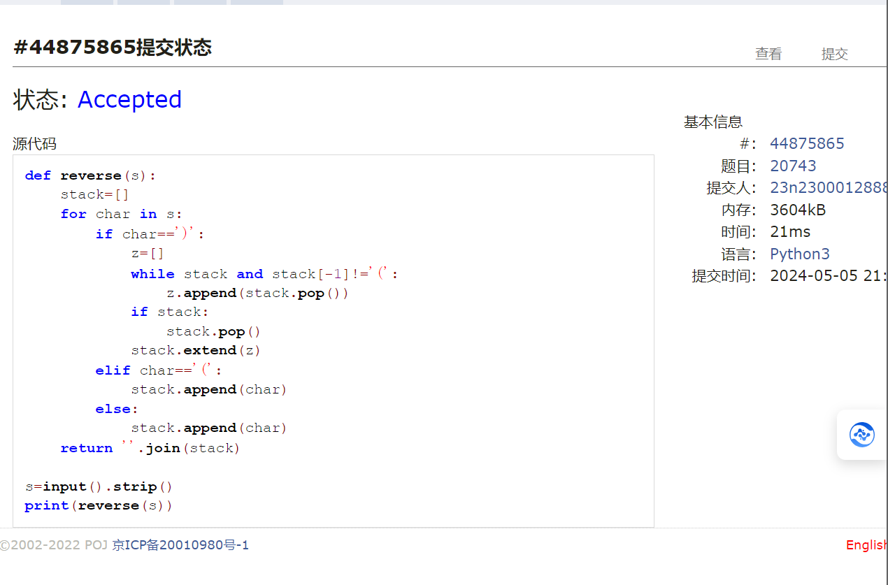
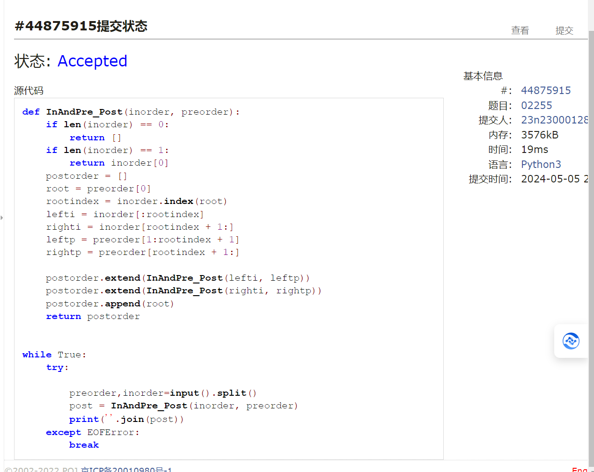
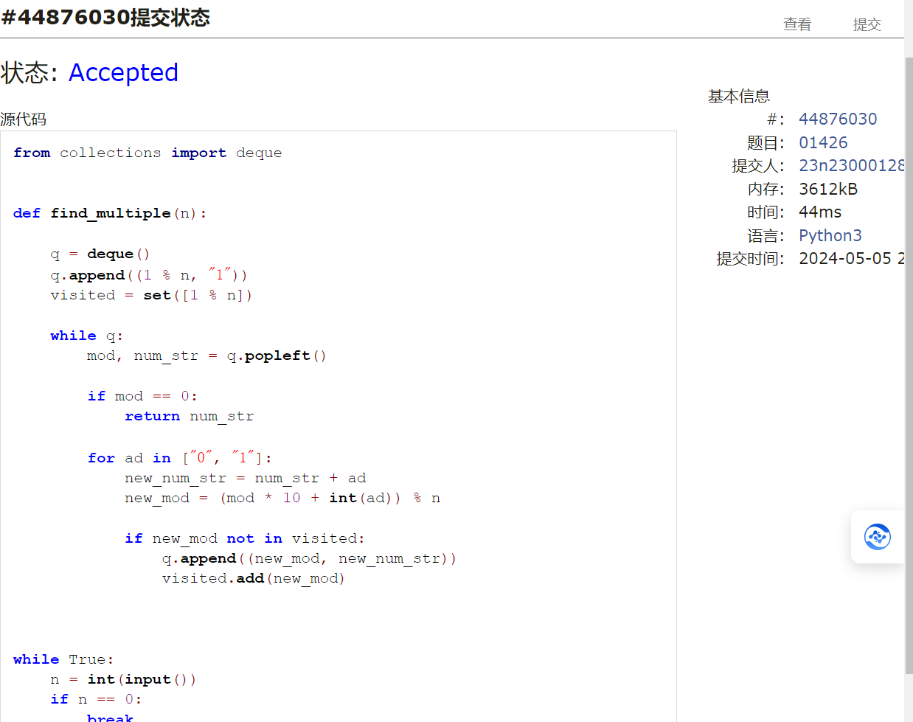
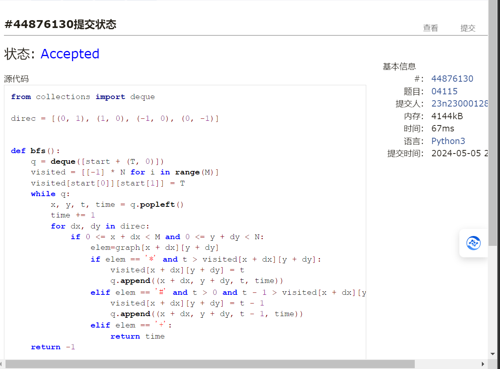
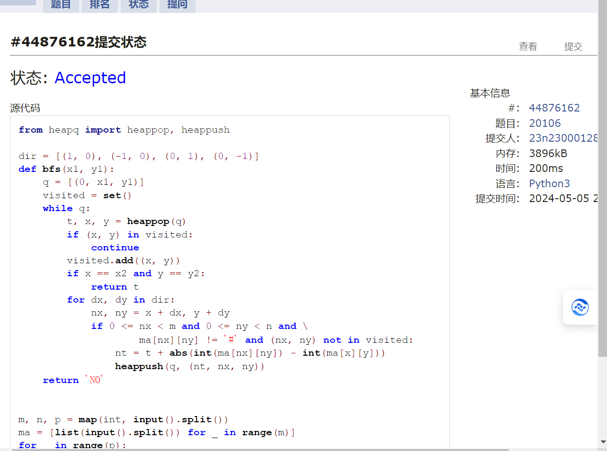

# Assignment #A: 图论：算法，树算及栈

Updated 2018 GMT+8 Apr 21, 2024

2024 spring, Complied by ==张坤 信科==


## 1. 题目

### 20743: 整人的提词本

http://cs101.openjudge.cn/practice/20743/


思路：使用stack 括号作为重要的标识符


代码

```python
def reverse(s):
    stack=[]
    for char in s:
        if char==')':
            z=[]
            while stack and stack[-1]!='(':
                z.append(stack.pop())
            if stack:
                stack.pop()
            stack.extend(z)
        elif char=='(':
            stack.append(char)
        else:
            stack.append(char)
    return ''.join(stack)

s=input().strip()
print(reverse(s))


```



代码运行截图 ==（至少包含有"Accepted"）==


### 02255: 重建二叉树

http://cs101.openjudge.cn/practice/02255/


思路：前中建树，前序第一个即为根节点，然后根据根节点，将左右子树分开，递归处理左右子树


代码

```python
def InAndPre_Post(inorder, preorder):
    if len(inorder) == 0:
        return []
    if len(inorder) == 1:
        return inorder[0]
    postorder = []
    root = preorder[0]
    rootindex = inorder.index(root)
    lefti = inorder[:rootindex]
    righti = inorder[rootindex + 1:]
    leftp = preorder[1:rootindex + 1]
    rightp = preorder[rootindex + 1:]

    postorder.extend(InAndPre_Post(lefti, leftp))
    postorder.extend(InAndPre_Post(righti, rightp))
    postorder.append(root)
    return postorder


while True:
    try:

        preorder,inorder=input().split()
        post = InAndPre_Post(inorder, preorder)
        print(''.join(post))
    except EOFError:
        break


```



代码运行截图 ==（至少包含有"Accepted"）==


### 01426: Find The Multiple

http://cs101.openjudge.cn/practice/01426/

要求用bfs实现


思路：剪纸的思路可以减少时间复杂度，二叉树的思路让我很受震撼


代码

```python
from collections import deque


def find_multiple(n):

    q = deque()
    q.append((1 % n, "1"))
    visited = set([1 % n])  
    
    while q:
        mod, num_str = q.popleft()

        if mod == 0:
            return num_str
        
        for ad in ["0", "1"]:
            new_num_str = num_str + ad
            new_mod = (mod * 10 + int(ad)) % n

            if new_mod not in visited:
                q.append((new_mod, new_num_str))
                visited.add(new_mod)


while True:
    n = int(input())
    if n == 0:
        break
    print(find_multiple(n))


```



代码运行截图 ==（AC代码截图，至少包含有"Accepted"）==


### 04115: 鸣人和佐助

bfs, http://cs101.openjudge.cn/practice/04115/


思路：bfs 注意查克拉的更新


代码

```python
from collections import deque

direc = [(0, 1), (1, 0), (-1, 0), (0, -1)]


def bfs():
    q = deque([start + (T, 0)])
    visited = [[-1] * N for i in range(M)]
    visited[start[0]][start[1]] = T
    while q:
        x, y, t, time = q.popleft()
        time += 1
        for dx, dy in direc:
            if 0 <= x + dx < M and 0 <= y + dy < N:
                elem=graph[x + dx][y + dy]
                if elem == '*' and t > visited[x + dx][y + dy]:
                    visited[x + dx][y + dy] = t
                    q.append((x + dx, y + dy, t, time))
                elif elem == '#' and t > 0 and t - 1 > visited[x + dx][y + dy]:
                    visited[x + dx][y + dy] = t - 1
                    q.append((x + dx, y + dy, t - 1, time))
                elif elem == '+':
                    return time
    return -1


M, N, T = map(int, input().split())
graph = [list(input()) for i in range(M)]
start =  None
for i in range(M):
    for j in range(N):
        if graph[i][j] == '@':
            start = (i, j)

print(bfs())


```



代码运行截图 ==（AC代码截图，至少包含有"Accepted"）==


### 20106: 走山路

Dijkstra, http://cs101.openjudge.cn/practice/20106/


思路：依旧是bfs


代码

```python
from heapq import heappop, heappush

dir = [(1, 0), (-1, 0), (0, 1), (0, -1)]
def bfs(x1, y1):
    q = [(0, x1, y1)]
    visited = set()
    while q:
        t, x, y = heappop(q)
        if (x, y) in visited:  
            continue
        visited.add((x, y))
        if x == x2 and y == y2:
            return t
        for dx, dy in dir:
            nx, ny = x + dx, y + dy
            if 0 <= nx < m and 0 <= ny < n and \
                    ma[nx][ny] != '#' and (nx, ny) not in visited:
                nt = t + abs(int(ma[nx][ny]) - int(ma[x][y]))
                heappush(q, (nt, nx, ny))
    return 'NO'


m, n, p = map(int, input().split())
ma = [list(input().split()) for _ in range(m)]
for _ in range(p):
    x1, y1, x2, y2 = map(int, input().split())
    if ma[x1][y1] == '#' or ma[x2][y2] == '#':
        print('NO')
        continue
    print(bfs(x1, y1))


```



代码运行截图 ==（AC代码截图，至少包含有"Accepted"）==


### 05442: 兔子与星空

Prim, http://cs101.openjudge.cn/practice/05442/


思路：


代码

```python
# 

```


代码运行截图 ==（AC代码截图，至少包含有"Accepted"）==


## 2. 学习总结和收获

==如果作业题目简单，有否额外练习题目，比如：OJ“2024spring每日选做”、CF、LeetCode、洛谷等网站题目。==
1.这次作业连着几道bfs，对bfs掌握更好了，while和剪纸步骤用的更熟练了
2.题词本也是让我捡起了久违的栈和括号消除法
3.multiple一题的思路很重要，不要从倍数一个一个找，而是从二进制数里找，这样会快很多


