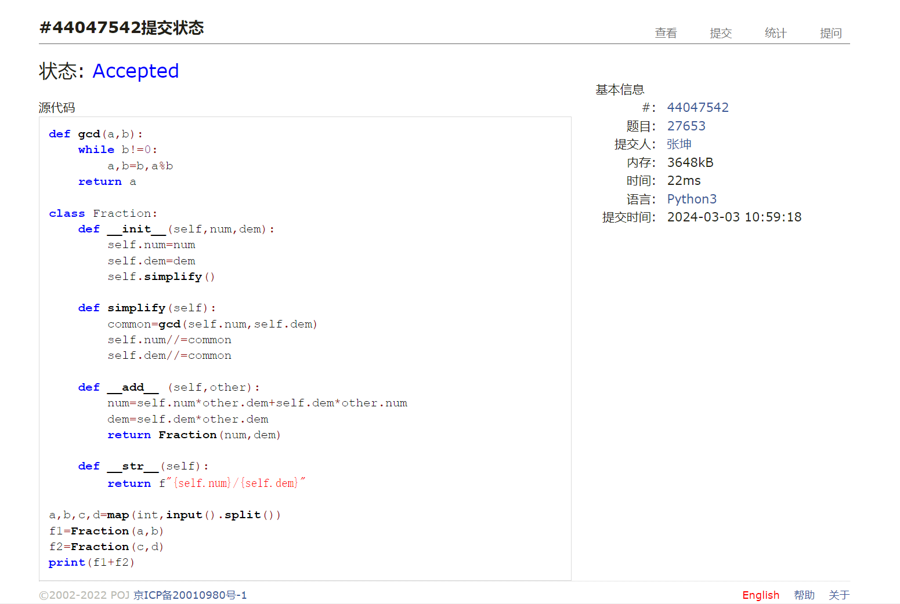

#      assignment2
2024 spring，compiled by 张坤 信科电子信息专业
## 1.题目
### 1.Fraction类
#### 用时；10分钟
#### 代码
```py
def gcd(a,b):
    while b!=0:
        a,b=b,a%b
    return a

class Fraction:
    def __init__(self,num,dem):
        self.num=num
        self.dem=dem
        self.simplify()
    
    def simplify(self):
        common=gcd(self.num,self.dem)
        self.num//=common
        self.dem//=common
    
    def __add__ (self,other):
        num=self.num*other.dem+self.dem*other.num
        dem=self.dem*other.dem
        return Fraction(num,dem)
    
    def __str__(self):
        return f"{self.num}/{self.dem}"

a,b,c,d=map(int,input().split())
f1=Fraction(a,b)
f2=Fraction(c,d)
print(f1+f2)
```


### 2.圣诞老人的礼物
#### 用时：12分钟
#### 代码
```py
n,w=map(int,input().split())
a=[]

for _ in range(n):
    value,p=map(int,input().split())
    for _ in range(p):
        a.append(value/p)
    
a.sort(reverse=True)
value=sum(a[:w])
print("{:.1f}".format(value))
```

 
### 3.打怪兽
#### 用时：10分钟
#### 代码
```py
cases=int(input())
for i in range(cases):
    n,m,b=map(int,input().split())
    situation="alive"
    a={}
    for j in range(n):
        x,y=map(int,input().split())
        if x not in a:
            a[x]=[y]
        else:
            a[x].append(y)
    
    c=sorted(a)
    for j in c:
        if m>len(a[j]):
            b-=sum(a[j])
        else:
            a[j].sort(reverse=True)
            b-=sum(a[j][:m])
        if b<=0:
            situation=j
            break
    print(situation)
```


### 4.T-primes
#### 用时：8分钟
#### 代码
```py
a=[1]*(10**6)
a[0]=0
for i in range(1,10**3,1):
    if a[i]==1:
        for j in range(2*i+1,10**6,i+1):
            a[j]=0

n=int(input())
q=list(map(int,input().split()))
for i in range(n):
    p=q[i]
    if p**0.5%1==0:
        r=int(p**0.5)
        if a[r-1]==1:
            print('YES')
        else:
            print("NO")
    else:
        print("NO")
```

### 5.XXXXX
#### 用时：20分钟
#### 代码
```py
def stfix(nums):
    st=[]
    sumn=0
    for num in nums:
        sumn+=num
        st.append(sumn)
    return st

def edfix(nums):
    ed=[]
    sumn=0
    reverse=nums[::-1]
    for num in reverse:
        sumn+=num
        ed.append(sumn)
    ed.reverse()
    return ed

cases=int(input())
for _ in range(cases):
    N,x=map(int,input().split())
    a=[int(i) for i in input().split()]
    sta=stfix(a)
    end=edfix(a)
    left,right=0,N-1
    if right==0:
        if a[0]%x!=0:
            print(1)
        else:
            print(-1)
        continue

    leftm,rightm=0,0
    while left!=right:
        total=end[left]
        if total%x!=0:
            leftm=right-left+1
            break
        else:
            left+=1
    
    left=0
    right=N-1
    while left!=right:
        total=sta[right]
        if total%x!=0:
            rightm=right-left +1
            break
        else:
            right-=1

    if leftm==0 and rightm==0:
        print(-1)
    else:
        print(max(leftm,rightm))
```

### 6.2050年成绩计算
#### 用时：15分钟
#### 代码
```py
a=[1]*(10**4)
a[0]=0
for i in range(1,10**2,1):
    if a[i]==1:
        for j in range(2*i+1,10**4,i+1):
            a[j]=0

m,n=map(int,input().split())
for _ in range(m):
    li=[int(i) for i in input().split()]
    total=0
    for number in li:
        r=int(number**0.5)
        if number>3 and a[r-1] and number==r**2:
            total+=number
    total/=len(li)
    if total==0:
        print(0)
    else:
        print("{:.2f}".format(total))
```

# 2.学习与总结
## day3 2024.3.3
### 1.class __str__
用于定义字符串形式的输出
frac = Fraction(3, 4)
print(frac)  # 输出：3/4
def __str__(self):
    return f"{self.numerator}/{self.denominator}"
注意这个小f 在Python中，f-string是一种用于格式化字符串的语法。它是在字符串前加上字母f的字符串字面值。f-string允许在字符串中插入表达式，并将其结果作为字符串的一部分。
### 2.map
map()函数将一个函数应用到一个可迭代对象的每个元素上，返回一个由应用函数后的结果组成的迭代器。
在这里，map(int, input().split())将int()函数应用到split()方法返回的列表的每个元素上，将其转换为整数。返回的是一个迭代器。
### 3.sum
value=sum(a[:w])是一个Python代码片段，用于计算列表 a 的前 w 个元素的总和。

在这个代码中，a 是一个列表，w 是一个整数。通过使用切片操作 a[:w]，我们可以获取列表 a 的前 w 个元素，然后使用 sum() 函数对这些元素求和，将结果赋值给变量 value。
### 4.小数的表达
value = 6.12345
print("{:.1f}".format(value))
6.1
### 5.字典中的列表
代码片段 if x not in a: a[x] = [y] 用于检查字典 a 中是否存在键 x，如果不存在则将键 x 添加到字典 a 中，并将其对应的值设置为包含元素 y 的列表。
### 6.切片操作
切片操作是一种用于从序列（如列表、字符串等）中获取子序列的方法。它的基本语法是 sequence[start:stop:step]，其中：

start 表示切片的起始位置（包含在切片中）
stop 表示切片的结束位置（不包含在切片中）
step 表示切片的步长（默认为1）
