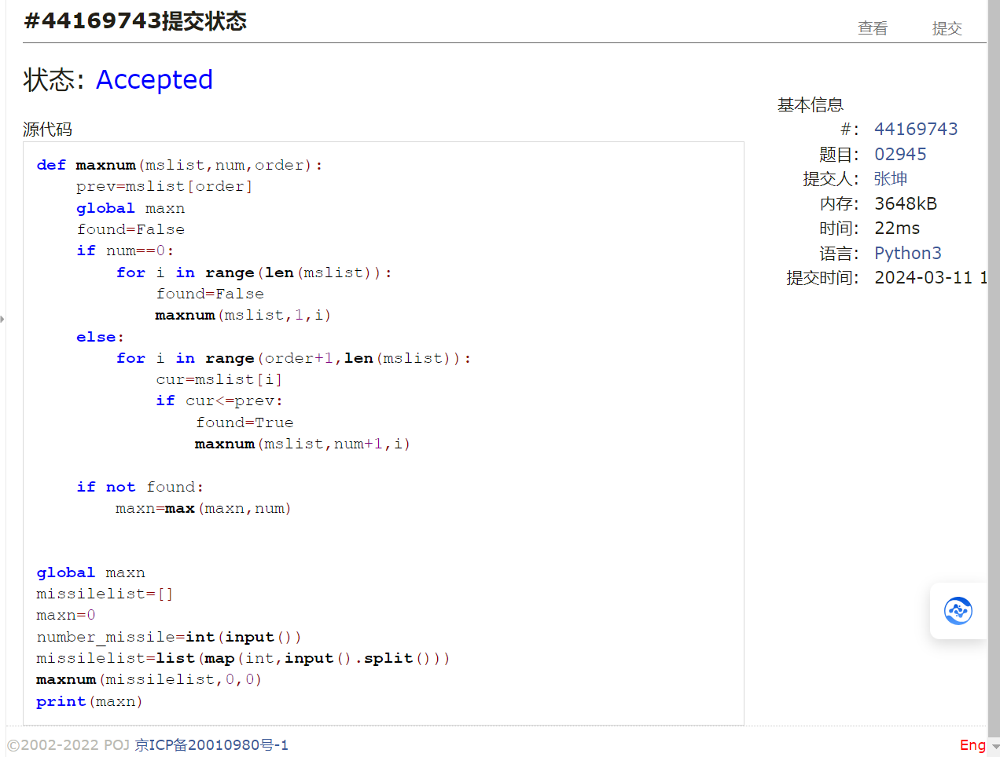
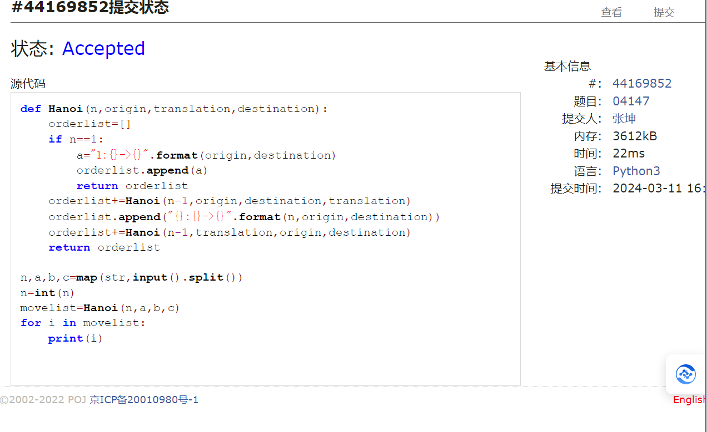
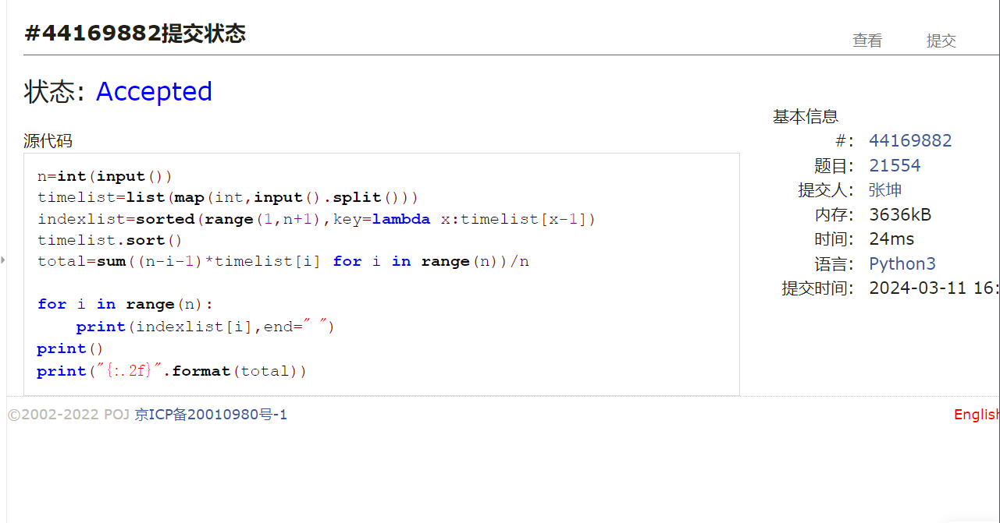
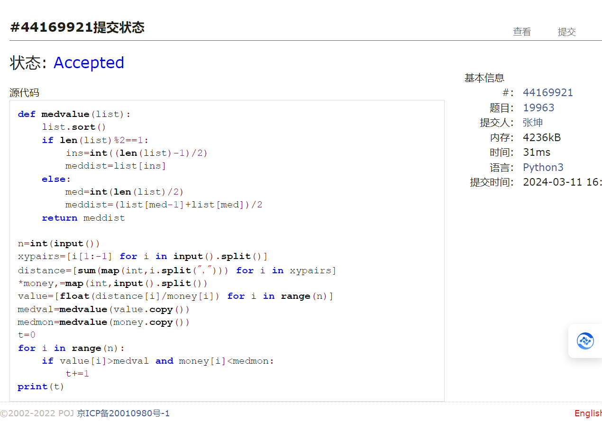
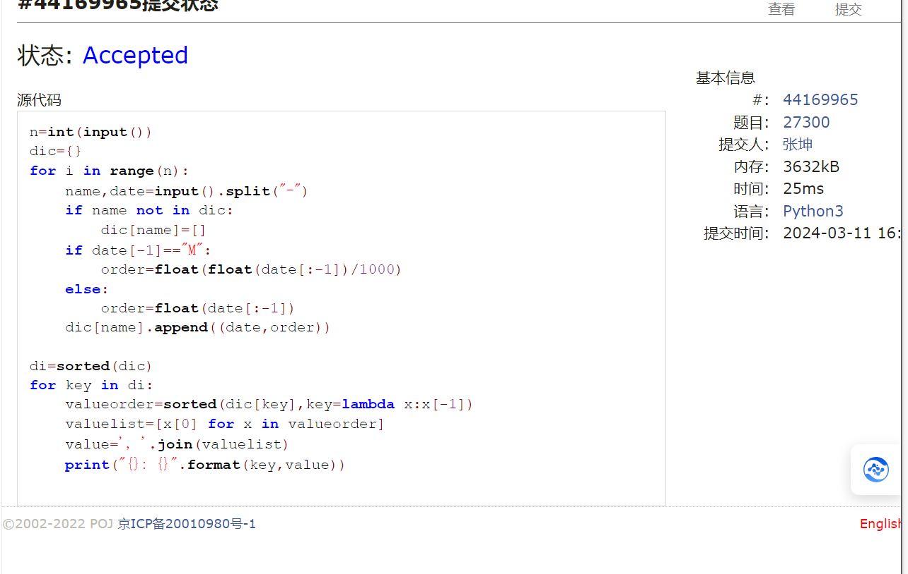

#      assignment3
2024 spring，compiled by 张坤 信科电子信息专业
## 1.题目
### 1.约瑟夫问题
#### 用时：12分钟
#### 思路：运用deque函数，通过popleft和append函数使这个列表变形为一个循环圆形，再对其中被选中的数字只进行pop处理即可
#### 代码
```py
from collections import deque
def out_list(num,first,m):
    list=deque()
    outlist=[]
    for i in range(num):
        list.append(i+1)
    
    for i in range(first-1):
        list.append(list.popleft())
    
    while len(list)>1:
        for index in range(m-1):
            list.append(list.popleft())
        outlist.append(str(list.popleft()))
    outlist.append(str(list.pop()))
    return outlist

while True:
    n,p,m=map(int,input().split())
    if n==0 and m==0 and p==0:
        break
    outlist=out_list(n,p,m)
    print(",".join(outlist))
```

### 2.拦截导弹
#### 用时：15分钟
#### 思路：运用递归的思想，进行深度搜索，将满足条件的不同可能进行分支再搜索
#### 代码
```py
def maxnum(mslist,num,order):
    prev=mslist[order]
    global maxn
    found=False
    if num==0:
        for i in range(len(mslist)):
            found=False
            maxnum(mslist,1,i)
    else:
        for i in range(order+1,len(mslist)):
            cur=mslist[i]
            if cur<=prev:
                found=True
                maxnum(mslist,num+1,i)

    if not found:
        maxn=max(maxn,num)
    

global maxn
missilelist=[]
maxn=0
number_missile=int(input())
missilelist=list(map(int,input().split()))
maxnum(missilelist,0,0)
print(maxn)
```

### 3.汉诺塔问题
#### 用时：12分钟
#### 思路：这是一道经典递归题，不过此题我们要求解每次的移动步骤，这就需要我们更深层次地理解这个递归过程，从n-1到n次到底是如何变化的：三个柱子，分别可以对应origin起点，translation中转点与destination终点，在n层移动时，实际上是先以f（n-1）第一个柱子为起点，第二个柱子为终点进行移动，再单独移动一步：即第n片放到第三个柱子的底部，再接上f（n-1）第二个柱子为起点，第三个柱子为终点移动，这就是更具体的递归思路
#### 代码
```py
def Hanoi(n,origin,translation,destination):
    orderlist=[]
    if n==1:
        a="1:{}->{}".format(origin,destination)
        orderlist.append(a)
        return orderlist
    orderlist+=Hanoi(n-1,origin,destination,translation)
    orderlist.append("{}:{}->{}".format(n,origin,destination))
    orderlist+=Hanoi(n-1,translation,origin,destination)
    return orderlist

n,a,b,c=map(str,input().split())
n=int(n)
movelist=Hanoi(n,a,b,c)
for i in movelist:
    print(i)
```

### 4.排队做实验
#### 用时：12分钟
#### 思路：运用一个很巧妙的sort来对索引进行排序，排序所用的值即为该索引对应时间的大小
#### 代码
```py
n=int(input())
timelist=list(map(int,input().split()))
indexlist=sorted(range(1,n+1),key=lambda x:timelist[x-1])
timelist.sort()
total=sum((n-i-1)*timelist[i] for i in range(n))/n

for i in range(n):
    print(indexlist[i],end=" ")
print()
print("{:.2f}".format(total))
```

### 5.买学区房
#### 用时：10分钟
#### 思路：求中位数再比较即可
#### 代码
```py
def medvalue(list):
    list.sort()
    if len(list)%2==1:
        ins=int((len(list)-1)/2)
        meddist=list[ins]
    else:
        med=int(len(list)/2)
        meddist=(list[med-1]+list[med])/2
    return meddist

n=int(input())
xypairs=[i[1:-1] for i in input().split()]
distance=[sum(map(int,i.split(","))) for i in xypairs]
*money,=map(int,input().split())
value=[float(distance[i]/money[i]) for i in range(n)]
medval=medvalue(value.copy())
medmon=medvalue(money.copy())
t=0
for i in range(n):
    if value[i]>medval and money[i]<medmon:
        t+=1
print(t)
```

### 6.模型整理
#### 用时：20分钟
#### 思路：一道简单的题，深刻让我体会到了细节的重要性，以及defaultdict的便捷性
#### 代码
```py
n=int(input())
dic={}
for i in range(n):
    name,date=input().split("-")
    if name not in dic:
        dic[name]=[]
    if date[-1]=="M":
        order=float(float(date[:-1])/1000)
    else:
        order=float(date[:-1])
    dic[name].append((date,order))

di=sorted(dic)
for key in di:
    valueorder=sorted(dic[key],key=lambda x:x[-1])
    valuelist=[x[0] for x in valueorder]
    value=', '.join(valuelist)
    print("{}: {}".format(key,value))
```

## 2.学习与收获
### 1.主要整理了上课中遇到的很多代码（队列与栈 前缀后缀等等），收获很大，并且挑着做了一些每日题，很有收获
### 2.学习日记如下：
## day5 2024.3.6
### 1.pop
queue.pop(0) 是一个用于从列表或队列中移除并返回第一个元素的操作。()默认是最后一位
## day6 2024.3.7
### 1.全局变量global
一定要在函数内部再声明依次
### 2.字符串表达式 eval
根据您的代码逻辑，eval(cal() + cur + cal()) 将会先调用 cal() 函数两次，然后将两次调用的结果与 cur 进行字符串拼接，最后使用 eval() 函数对拼接后的字符串进行求值。

如果您想将求值结果转换为字符串，可以使用 str() 函数。所以，您可以将 str(eval(cal() + cur + cal())) 作为一个表达式，将其结果转换为字符串。
### 3.format
print("%.6f" % float(calc()))
print("{:.6f}".format(float(calc())))
留意这个大括号啊！
### 4.条件表达式
这行代码使用了条件表达式（ternary operator）的语法。条件表达式的一般形式是 expression1 if condition else expression2，
a= poland() if l[0] in "+-*/ else l.pop(0)
### 5.index 索引方法
index() 是 Python 中的一个字符串方法，用于返回指定字符串在另一个字符串中的索引位置。
## day7 2024.3.8
### 1.数字验证 isnumeric
char.isnumeric() 是一个字符串方法，用于检查一个字符是否是数字。它返回一个布尔值，表示该字符是否为数字。
### 2.整数验证 is_integer
num.is_integer() 是一个浮点数方法，用于检查一个数字是否为整数。它返回一个布尔值，表示该数字是否为整数。
### 3.join函数的纰漏
这个错误 "sequence item 0: expected str instance, int found" 意味着你在一个序列（如字符串或列表）中使用了一个整数，而预期的是一个字符串实例。

这通常发生在你尝试将一个整数值作为字符串的一部分或列表的一个元素来使用，但是需要注意的是，不同的数据类型在组合时需要进行类型匹配。
## day8 2024.3.9   
### 1.copy 副本
具体来说，copy() 方法用于复制一个列表，并返回一个新的列表副本，其中包含了原列表中的所有元素。这样做的目的是为了避免对原列表进行修改时，影响到副本列表。
### 2.链表的使用要仔细
### 3.数据类型啊别搞错了啊喂
## day9 2024.3.11
### 1.字典
字典只能通过sorted（）排序 并且的到一个列表 而非字典
### 2.sort语法
indexlist=sorted(range(1,n+1),key=lambda x:timelist[x-1])
### 3.copy
很多函数内部可能会改变列表值 在函数内对列表操作时记得加上copy