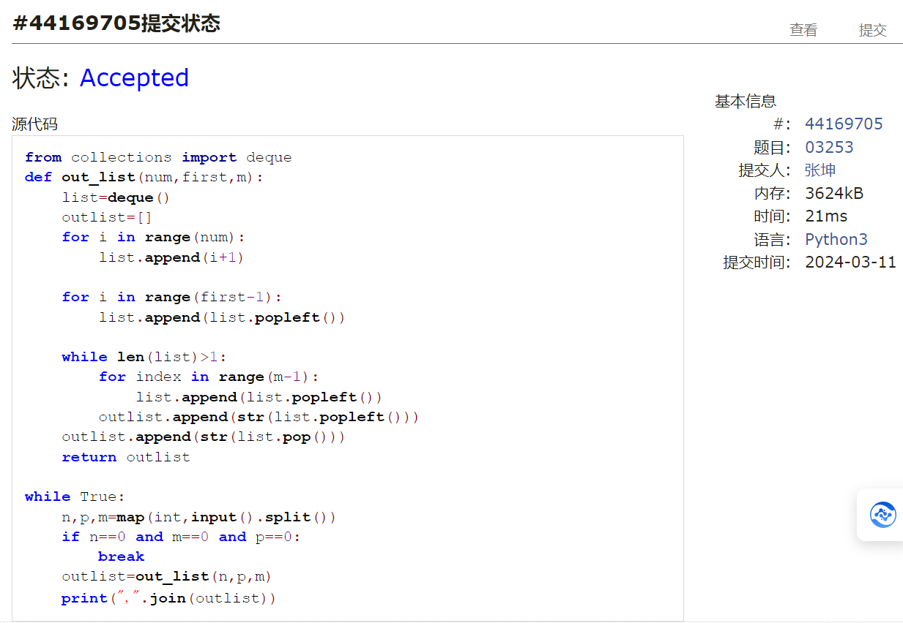

#      assignment3
2024 spring，compiled by 张坤 信科电子信息专业
## 1.题目
### 1.约瑟夫问题
#### 用时：12分钟
#### 思路：运用deque函数，通过popleft和append函数使这个列表变形为一个循环圆形，再对其中被选中的数字只进行pop处理即可
#### 代码
```py
from collections import deque
def out_list(num,first,m):
    list=deque()
    outlist=[]
    for i in range(num):
        list.append(i+1)
    
    for i in range(first-1):
        list.append(list.popleft())
    
    while len(list)>1:
        for index in range(m-1):
            list.append(list.popleft())
        outlist.append(str(list.popleft()))
    outlist.append(str(list.pop()))
    return outlist

while True:
    n,p,m=map(int,input().split())
    if n==0 and m==0 and p==0:
        break
    outlist=out_list(n,p,m)
    print(",".join(outlist))
```
