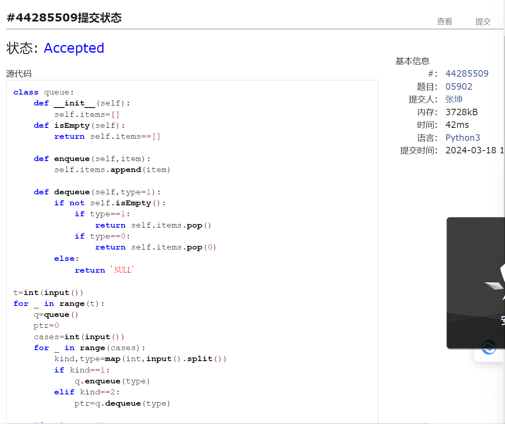
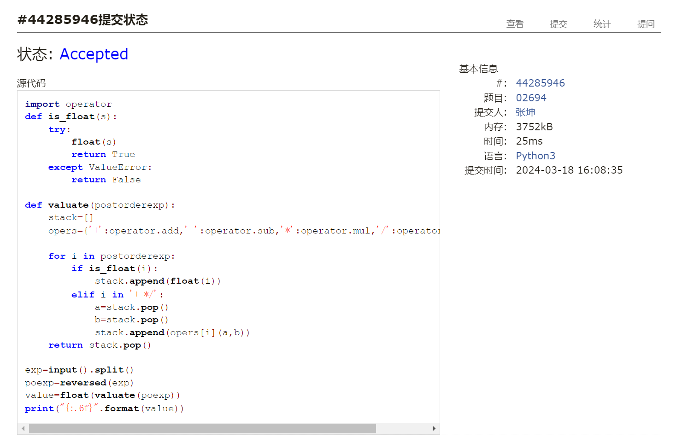
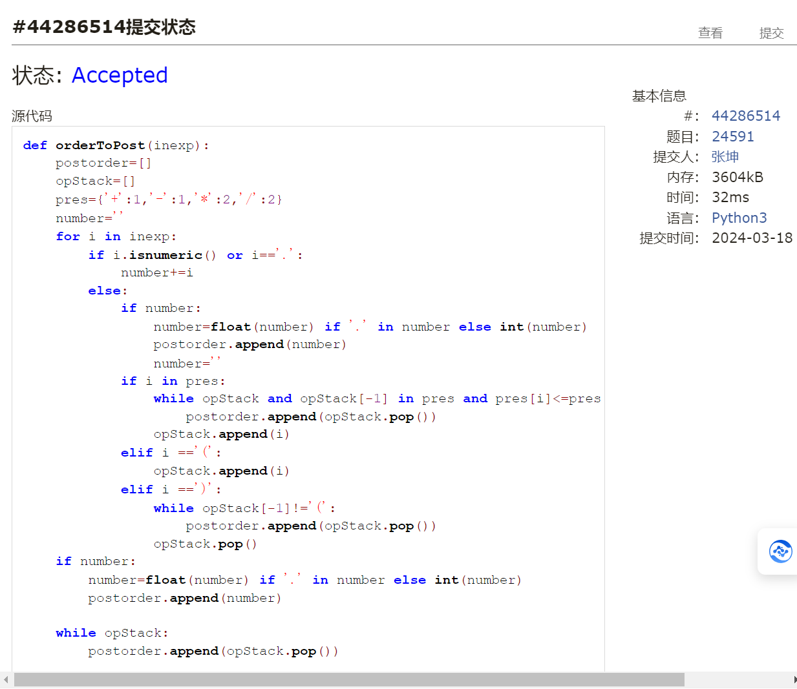
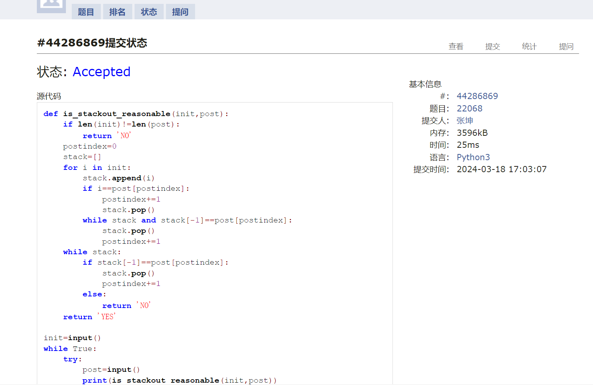
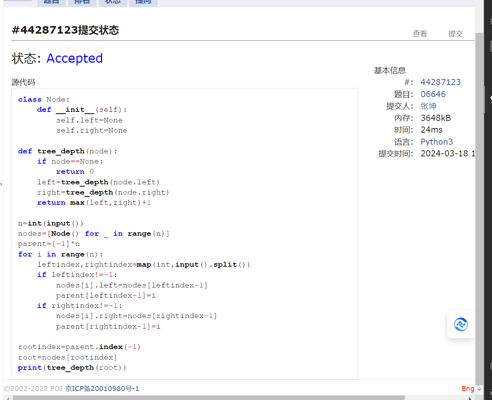
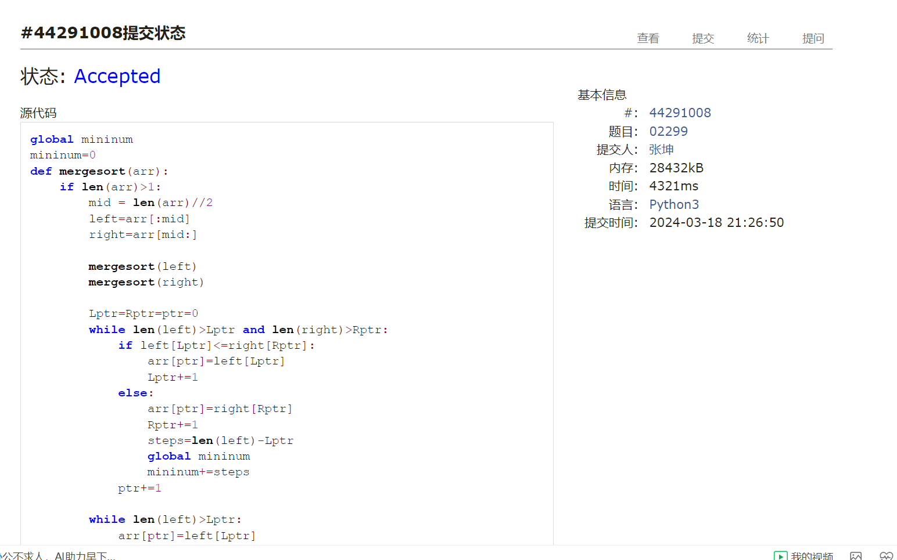

# Assignment #4: 排序、栈、队列和树

Updated 0005 GMT+8 March 11, 2024

2024 spring, Complied by ==同学的姓名、院系==


**说明：**

1）The complete process to learn DSA from scratch can be broken into 4 parts:

Learn about Time complexities, learn the basics of individual Data Structures, learn the basics of Algorithms, and practice Problems.

2）请把每个题目解题思路（可选），源码Python, 或者C++（已经在Codeforces/Openjudge上AC），截图（包含Accepted），填写到下面作业模版中（推荐使用 typora https://typoraio.cn ，或者用word）。AC 或者没有AC，都请标上每个题目大致花费时间。

3）提交时候先提交pdf文件，再把md或者doc文件上传到右侧“作业评论”。Canvas需要有同学清晰头像、提交文件有pdf、"作业评论"区有上传的md或者doc附件。

4）如果不能在截止前提交作业，请写明原因。


**编程环境**

==（请改为同学的操作系统、编程环境等）==

操作系统：macOS Ventura 13.4.1 (c)

Python编程环境：Spyder IDE 5.2.2, PyCharm 2023.1.4 (Professional Edition)

C/C++编程环境：Mac terminal vi (version 9.0.1424), g++/gcc (Apple clang version 14.0.3, clang-1403.0.22.14.1)


## 1. 题目

### 05902: 双端队列

http://cs101.openjudge.cn/practice/05902/


思路：pop()与pop(0)


代码

```python
class queue:
    def __init__(self):
        self.items=[]
    def isEmpty(self):
        return self.items==[]
    
    def enqueue(self,item):
        self.items.append(item)
        
    def dequeue(self,type=1):
        if not self.isEmpty():   
            if type==1:
                return self.items.pop()
            if type==0:
                return self.items.pop(0)
        else:
            return 'NULL'
        
t=int(input())
for _ in range(t):
    q=queue()
    ptr=0
    cases=int(input())
    for _ in range(cases):
        kind,type=map(int,input().split())
        if kind==1:
            q.enqueue(type)
        elif kind==2:
            ptr=q.dequeue(type)
        
    if q.isEmpty():
        print('NULL')
    else:
        print(*q.items)

```



代码运行截图 ==（至少包含有"Accepted"）==


### 02694: 波兰表达式

http://cs101.openjudge.cn/practice/02694/


思路：先转成后序表达式 注意reverse和reversed的区别 
然后按照栈的思路去做


代码

```python
import operator
def is_float(s):
    try:
        float(s)
        return True
    except ValueError:
        return False

def valuate(postorderexp):
    stack=[]
    opers={'+':operator.add,'-':operator.sub,'*':operator.mul,'/':operator.truediv}

    for i in postorderexp:
        if is_float(i):
            stack.append(float(i))
        elif i in '+-*/':
            a=stack.pop()
            b=stack.pop()
            stack.append(opers[i](a,b))
    return stack.pop()

exp=input().split()
poexp=reversed(exp)
value=float(valuate(poexp))
print("{:.6f}".format(value))


```



代码运行截图 ==（至少包含有"Accepted"）==


### 24591: 中序表达式转后序表达式

http://cs101.openjudge.cn/practice/24591/


思路：调度场算法


代码

```python
def orderToPost(inexp):
    postorder=[]
    opStack=[]
    pres={'+':1,'-':1,'*':2,'/':2}
    number=''
    for i in inexp:
        if i.isnumeric() or i=='.':
            number+=i
        else:
            if number:
                number=float(number) if '.' in number else int(number)
                postorder.append(number)
                number=''
            if i in pres:
                while opStack and opStack[-1] in pres and pres[i]<=pres[opStack[-1]]:
                    postorder.append(opStack.pop())
                opStack.append(i)
            elif i =='(':
                opStack.append(i)
            elif i ==')':
                while opStack[-1]!='(':
                    postorder.append(opStack.pop())
                opStack.pop()
    if number:
        number=float(number) if '.' in number else int(number)
        postorder.append(number)

    while opStack:
        postorder.append(opStack.pop())

    return ' '.join(str(i) for i in postorder)


n=int(input())
for _ in range(n):
    infix=input() 
    print(orderToPost(infix))   

```



代码运行截图 ==（AC代码截图，至少包含有"Accepted"）==


### 22068: 合法出栈序列

http://cs101.openjudge.cn/practice/22068/


思路：正常入栈 如果栈顶与序列尾部相同则出栈


代码

```python
def is_stackout_reasonable(init,post):
    if len(init)!=len(post):
        return 'NO'
    postindex=0
    stack=[]
    for i in init:
        stack.append(i)
        if i==post[postindex]:
            postindex+=1
            stack.pop()
        while stack and stack[-1]==post[postindex]:
            stack.pop()
            postindex+=1
    while stack:
        if stack[-1]==post[postindex]:
            stack.pop()
            postindex+=1
        else:
            return 'NO'
    return 'YES'

init=input()
while True:
    try:
        post=input()
        print(is_stackout_reasonable(init,post))
    except EOFError:
        break
    def is_stackout_reasonable(init,post):
    if len(init)!=len(post):
        return 'NO'
    postindex=0
    stack=[]
    for i in init:
        stack.append(i)
        if i==post[postindex]:
            postindex+=1
            stack.pop()
        while stack and stack[-1]==post[postindex]:
            stack.pop()
            postindex+=1
    while stack:
        if stack[-1]==post[postindex]:
            stack.pop()
            postindex+=1
        else:
            return 'NO'
    return 'YES'

init=input()
while True:
    try:
        post=input()
        print(is_stackout_reasonable(init,post))
    except EOFError:
        break
    

```



代码运行截图 ==（AC代码截图，至少包含有"Accepted"）==


### 06646: 二叉树的深度

http://cs101.openjudge.cn/practice/06646/


思路：


代码

```python
class Node:
    def __init__(self):
        self.left=None
        self.right=None

def tree_depth(node):
    if node==None:
        return 0
    left=tree_depth(node.left)
    right=tree_depth(node.right)
    return max(left,right)+1

n=int(input())
nodes=[Node() for _ in range(n)]
parent=[-1]*n
for i in range(n):
    leftindex,rightindex=map(int,input().split())
    if leftindex!=-1:
        nodes[i].left=nodes[leftindex-1]
        parent[leftindex-1]=i
    if rightindex!=-1:
        nodes[i].right=nodes[rightindex-1]
        parent[rightindex-1]=i

rootindex=parent.index(-1)
root=nodes[rootindex]
print(tree_depth(root))

```



代码运行截图 ==（AC代码截图，至少包含有"Accepted"）==


### 02299: Ultra-QuickSort

http://cs101.openjudge.cn/practice/02299/


思路：merge sort


代码

```python
mininum=0
def mergesort(arr):
    global mininum
    if len(arr)>1:
        mid = len(arr)//2
        left=arr[:mid]
        right=arr[mid:]

        mergesort(left)
        mergesort(right)

        Lptr=Rptr=ptr=0
        while len(left)>Lptr and len(right)>Rptr:
            if left[Lptr]<=right[Rptr]:
                arr[ptr]=left[Lptr]
                Lptr+=1
            else:
                arr[ptr]=right[Rptr]
                Rptr+=1
                steps=len(left)-Lptr
                mininum+=steps
            ptr+=1
        
        while len(left)>Lptr:
            arr[ptr]=left[Lptr]
            ptr += 1
            Lptr += 1
        while len(right)>Rptr:
            arr[ptr]=right[Rptr]
            ptr += 1
            Rptr += 1

while True:
    mininum=0
    n=int(input())
    if n==0:
        break
    arr=[int(input()) for _ in range(n)]
    mergesort(arr)
    print(mininum)


```



代码运行截图 ==（AC代码截图，至少包含有"Accepted"）==


## 2. 学习总结和收获

### 1.要加强每日选做的训练

## day10 2024.3.16
### 1.二叉树常用
has_parent列表
nodes列表
node=None 指的是叶子的下一级
### 2.关于字典的索引与值的循环调用
for node, children in adjacency_list.items():
### 3.setdefault
1. `setdefault()` 是Python字典的一个方法。给定键 `x`，如果字典 `a` 中存在该键，则返回与之对应的值；若不存在，则先将一个空列表 `[]` 作为默认值存入字典，并返回这个新创建的空列表。
### 4.函数中的参数
def traversal(self,method='preorder')
若直接使用 traversal()则默认preorder
### 5.py中加减乘除计算的简便方法 字典
opers = {'+':operator.add, '-':operator.sub, '*':operator.mul, '/':operator.truediv}
fn = opers[parseTree.getRootVal()]
 return fn(evaluate(leftC),evaluate(rightC))
 ### 6.前中后序列的表达
 ```py
 def traversal(self,method='preorder'):
        if method == 'preorder':
            print(self.key,end=" ")
        if self.left!=None:
            self.left.traversal(method)
        if method =='inorder':
            print(self.key,end=" ")
        if self.right !=None:
            self.right.traversal(method)
        if method =='postorder':
            print(self.key,end=" ")
```
### 7.is函数
isupper 是否是大写字母  
islower 是否是小写字母   
isalpha 是否是字母  
isalnum 是否是字母或数字  
isdigit 是否是数字  
isnumeric 是否是数字  
isfloat 是否是浮点数  
isdecimal 是否是十进制    
num.is_integer() 是否是整数
isidentifier 是否是标识符  
## day11 2024.3.18
### 1.reverse
reverse() 方法不返回任何内容）。如果想得到一个反转后的新列表，应该使用 reversed() 函数：
### 2.新定义的函数
只能由lambda（sth） 不能用sth.lambda()
### 3.列表中寻找某个特定元素
1. in
2. list.index(item)返回列表中第一个出现的元素的索引
否则ValueError


