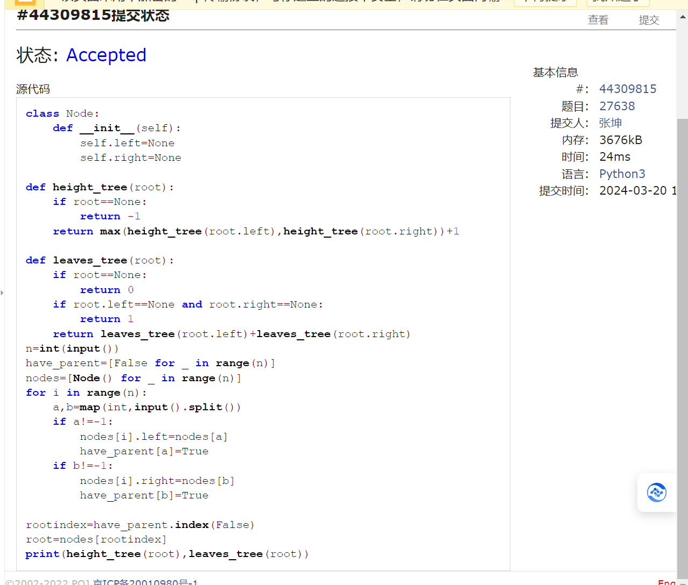
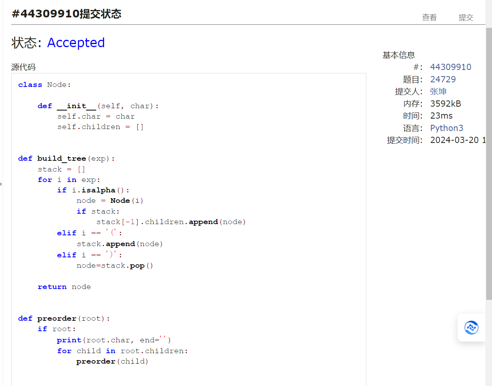
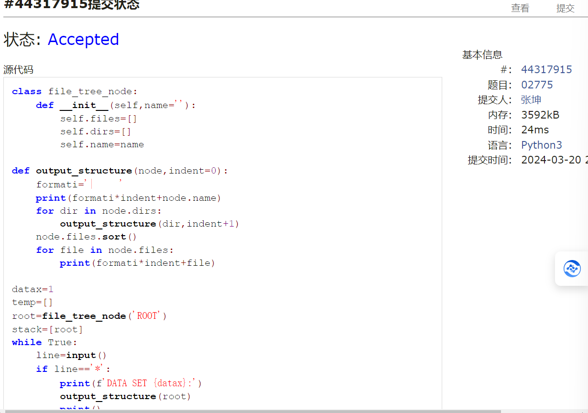
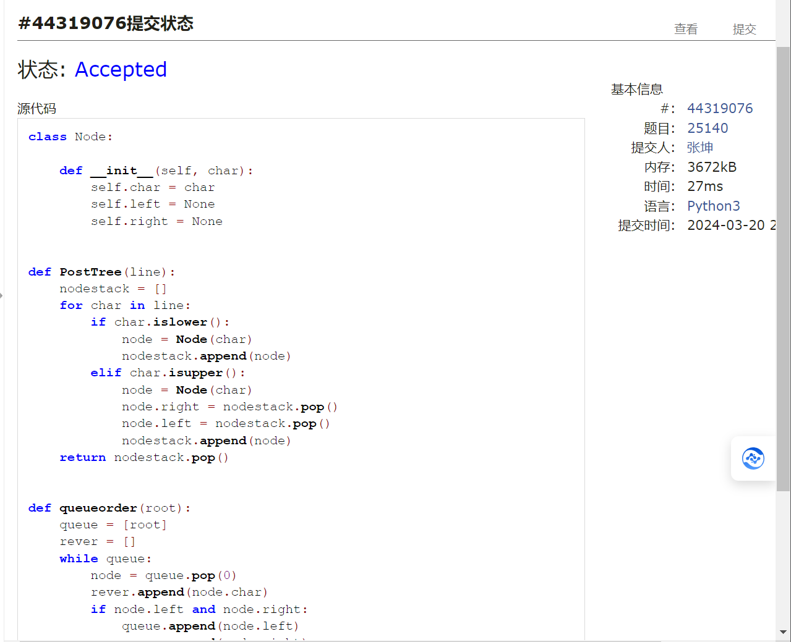
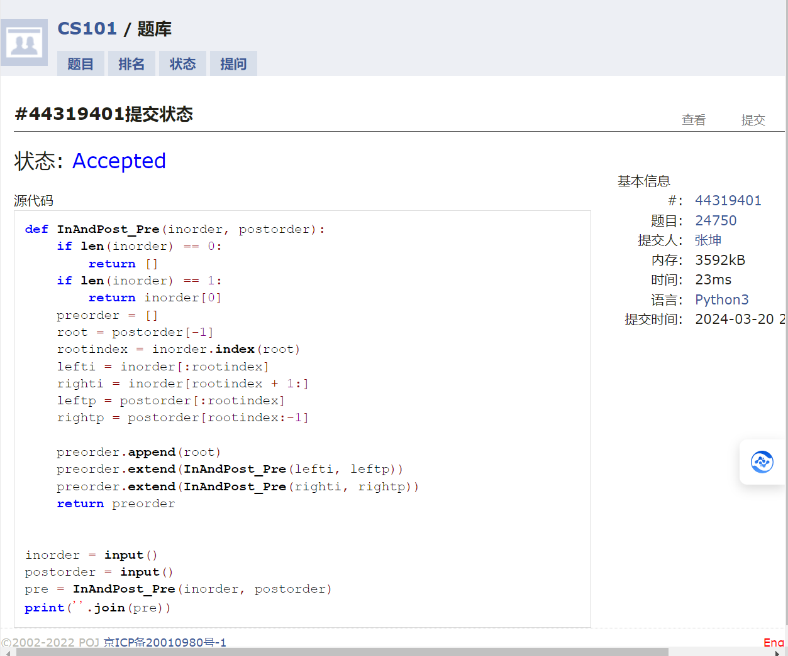
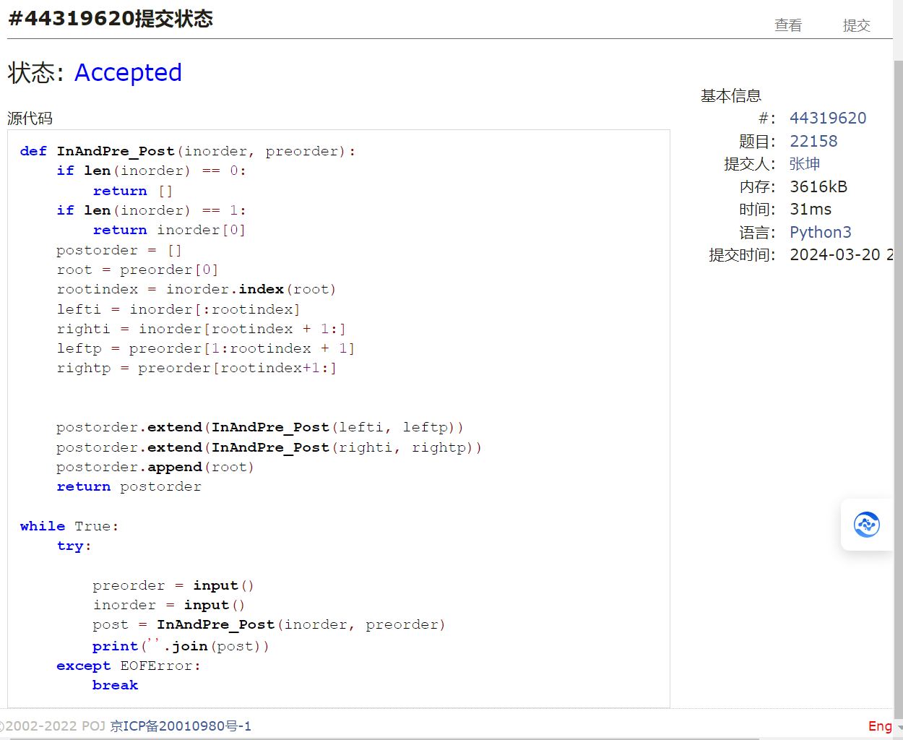

# Assignment #5: "树"算：概念、表示、解析、遍历

Updated 2124 GMT+8 March 17, 2024

2024 spring, Complied by ==张坤 信息科学技术学院==

**编程环境**

操作系统： Windows_NT x64 10.0.22631

Python 编程环境：VS code 1.87.2 (user setup)

## 1. 题目

### 27638: 求二叉树的高度和叶子数目

http://cs101.openjudge.cn/practice/27638/

思路：使用has_parent列表来找根结点，再进行递归求值

代码

```python
class Node:

    def __init__(self):
        self.left = None
        self.right = None


def height_tree(root):
    if root == None:
        return -1
    return max(height_tree(root.left), height_tree(root.right)) + 1


def leaves_tree(root):
    if root == None:
        return 0
    if root.left == None and root.right == None:
        return 1
    return leaves_tree(root.left) + leaves_tree(root.right)


n = int(input())
have_parent = [False for _ in range(n)]
nodes = [Node() for _ in range(n)]
for i in range(n):
    a, b = map(int, input().split())
    if a != -1:
        nodes[i].left = nodes[a]
        have_parent[a] = True
    if b != -1:
        nodes[i].right = nodes[b]
        have_parent[b] = True

rootindex = have_parent.index(False)
root = nodes[rootindex]
print(height_tree(root), leaves_tree(root))


```

代码运行截图 ==（至少包含有"Accepted"）==

### 24729: 括号嵌套树

http://cs101.openjudge.cn/practice/24729/

思路：写法其实很类似调度场算法，怪不得说这个算法很经典

代码

```python

class Node:

    def __init__(self, char):
        self.char = char
        self.children = []


def build_tree(exp):
    stack = []
    for i in exp:
        if i.isalpha():
            node = Node(i)
            if stack:
                stack[-1].children.append(node)
        elif i == '(':
            stack.append(node)
        elif i == ')':
            node=stack.pop()

    return node


def preorder(root):
    if root:
        print(root.char, end='')
        for child in root.children:
            preorder(child)


def postorder(root):
    if root:
        for child in root.children:
            postorder(child)
        print(root.char, end='')


exp = input()
root = build_tree(exp)
preorder(root)
print()
postorder(root)

```

代码运行截图 ==（至少包含有"Accepted"）==

### 02775: 文件结构“图”

http://cs101.openjudge.cn/practice/02775/

思路：将file和dir进行区分，可以把file看作叶结点，dir看作子树的根结点，不过在写法上要注意file和dir虽然在同一层级，但写法不同

代码

```python
class file_tree_node:

    def __init__(self, name=''):
        self.files = []
        self.dirs = []
        self.name = name


def output_structure(node, indent=0):
    formati = '|     '
    print(formati * indent + node.name)
    for dir in node.dirs:
        output_structure(dir, indent + 1)
    node.files.sort()
    for file in node.files:
        print(formati * indent + file)


datax = 1
temp = []
root = file_tree_node('ROOT')
stack = [root]
while True:
    line = input()
    if line == '*':
        print(f'DATA SET {datax}:')
        output_structure(root)
        print()
        root = file_tree_node('ROOT')
        stack = [root]
        temp = []
        datax += 1
    elif line == '#':
        break
    else:
        if line[0] == 'f':
            stack[-1].files.append(line)
        elif line[0] == 'd':
            node = file_tree_node(line)
            stack[-1].dirs.append(node)
            stack.append(node)
        elif line == ']':
            stack.pop()


```

代码运行截图 ==（AC 代码截图，至少包含有"Accepted"）==

### 25140: 根据后序表达式建立队列表达式

http://cs101.openjudge.cn/practice/25140/

思路：后序建树 主要利用了栈的思路，和后序表达式求值相近，然后队列表达式的建立与BFS相关

代码

```python
class Node:

    def __init__(self, char):
        self.char = char
        self.left = None
        self.right = None


def PostTree(line):
    nodestack = []
    for char in line:
        if char.islower():
            node = Node(char)
            nodestack.append(node)
        elif char.isupper():
            node = Node(char)
            node.right = nodestack.pop()
            node.left = nodestack.pop()
            nodestack.append(node)
    return nodestack.pop()


def queueorder(root):
    queue = [root]
    rever = []
    while queue:
        node = queue.pop(0)
        rever.append(node.char)
        if node.left and node.right:
            queue.append(node.left)
            queue.append(node.right)
    queor = reversed(rever)
    return ''.join(queor)


n = int(input())
for _ in range(n):
    line = input()
    root = PostTree(line)
    print(queueorder(root))


```

代码运行截图 ==（AC 代码截图，至少包含有"Accepted"）==

### 24750: 根据二叉树中后序序列建树

http://cs101.openjudge.cn/practice/24750/

思路：后序表达式中可以准确找到根，二中序表达式则可以准确地将根的左右子树分开，再对左右子树进行递归就可以成功建树了
但对应这道题目，其实可以不完全建树，在递归的过程中能注意顺序，即先中，后左再右，即可一遍记录下来前序序列，这样就不用建树了

代码

```python

def InAndPost_Pre(inorder, postorder):
    if len(inorder) == 0:
        return []
    if len(inorder) == 1:
        return inorder[0]
    preorder = []
    root = postorder[-1]
    rootindex = inorder.index(root)
    lefti = inorder[:rootindex]
    righti = inorder[rootindex + 1:]
    leftp = postorder[:rootindex]
    rightp = postorder[rootindex:-1]

    preorder.append(root)
    preorder.extend(InAndPost_Pre(lefti, leftp))
    preorder.extend(InAndPost_Pre(righti, rightp))
    return preorder


inorder = input()
postorder = input()
pre = InAndPost_Pre(inorder, postorder)
print(''.join(pre))

```

代码运行截图 ==（AC 代码截图，至少包含有"Accepted"）==

### 22158: 根据二叉树前中序序列建树

http://cs101.openjudge.cn/practice/22158/

思路：同上一道题

代码

```python

def InAndPre_Post(inorder, preorder):
    if len(inorder) == 0:
        return []
    if len(inorder) == 1:
        return inorder[0]
    postorder = []
    root = preorder[0]
    rootindex = inorder.index(root)
    lefti = inorder[:rootindex]
    righti = inorder[rootindex + 1:]
    leftp = preorder[1:rootindex + 1]
    rightp = preorder[rootindex + 1:]

    postorder.extend(InAndPre_Post(lefti, leftp))
    postorder.extend(InAndPre_Post(righti, rightp))
    postorder.append(root)
    return postorder


while True:
    try:

        preorder = input()
        inorder = input()
        post = InAndPre_Post(inorder, preorder)
        print(''.join(post))
    except EOFError:
        break

```

代码运行截图 ==（AC 代码截图，至少包含有"Accepted"）==

## 2. 学习总结和收获
1.完成了部分每日选做，很有收获，对于树的理解更深刻，体会到了树与栈的联动，还有树的遍历，其实三种遍历就是 结点的值在   （）左（）右（） 这样的顺序中的三个括号里的三种表现，而树的层序遍历就是一种BFS
2.学习日记
## day11 2024.3.18

### 1.reverse

reverse() 方法不返回任何内容）。如果想得到一个反转后的新列表，应该使用 reversed() 函数：

### 2.新定义的函数

只能由 lambda（sth） 不能用 sth.lambda()

### 3.列表中寻找某个特定元素

1. in
2. list.index(item)返回列表中第一个出现的元素的索引
   否则 ValueError
## day12 2024.3.19
### 1.bisect 有序列表
bisect.insort 是 Python 标准库 bisect 模块中的一个便捷函数，主要用于将元素插入到已排序的列表中，同时确保插入后列表仍然保持有序。具体有两个相关函数：
bisect.insort_left(list,item)
在有序列表list中将item插入到合适的位置，使得item左边的元素比item小  
## day13 2024.3.20
### 1.树与栈中数据不同步的问题
```python
node=file_tree_node(line)
            stack[-1].dirs.append(node)
            stack.append(node)
```
与
```py
    stack[-1].dirs.append(file_tree_node(line))
    stack.append(file_tree_node(line))
```
二者有很大的区别
### 2.BFS
```py
def bfs(root):
    queue=[root]
    rever=[]
    while queue:
        node=queue.pop(0)
        rever.append(node.val)
        if node.left:
            queue.append(node.left)
        if node.right:
            queue.append(node.right)
    queor=rever[::-1]
    return ''.join(queor)
```
