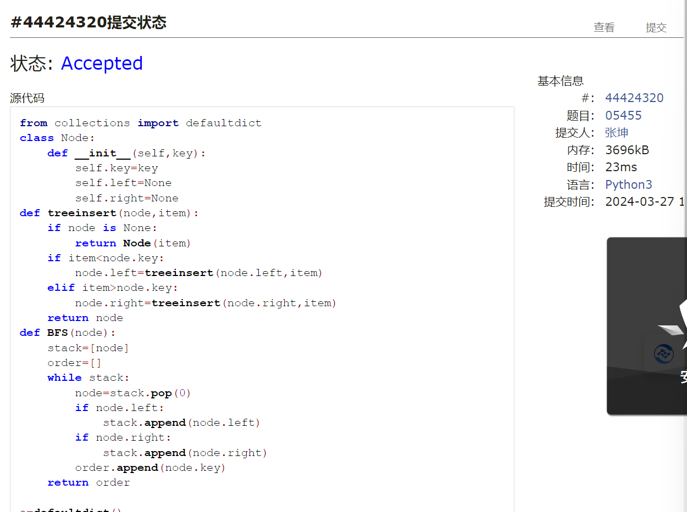

# Assignment #6: "树"算：Huffman,BinHeap,BST,AVL,DisjointSet

Updated 2214 GMT+8 March 24, 2024

2024 spring, Complied by ==同学的姓名、院系==


**说明：**

1）这次作业内容不简单，耗时长的话直接参考题解。

2）请把每个题目解题思路（可选），源码Python, 或者C++（已经在Codeforces/Openjudge上AC），截图（包含Accepted），填写到下面作业模版中（推荐使用 typora https://typoraio.cn ，或者用word）。AC 或者没有AC，都请标上每个题目大致花费时间。

3）提交时候先提交pdf文件，再把md或者doc文件上传到右侧“作业评论”。Canvas需要有同学清晰头像、提交文件有pdf、"作业评论"区有上传的md或者doc附件。

4）如果不能在截止前提交作业，请写明原因。


**编程环境**

==（请改为同学的操作系统、编程环境等）==

操作系统： Windows_NT x64 10.0.22631

Python 编程环境：VS code 1.87.2 (user setup)


## 1. 题目

### 22275: 二叉搜索树的遍历

http://cs101.openjudge.cn/practice/22275/


思路：结合二叉搜索树 左子树必小于结点 右子树必大于结点的性质进行递归


代码

```python
#class Node:

    def __init__(self, key):
        self.key = key
        self.left = None
        self.right = None


def preturn(prefix):
    s = len(prefix)
    if s == 0:
        return None
    node = Node(prefix[0])
    for i in range(1, s):
        if prefix[i] > prefix[0]:
            mid = i
            break
    else:
        mid = s
    left = prefix[1:mid]
    right = prefix[mid:]

    node.left = preturn(left)
    node.right = preturn(right)

    return node


def postorder(root):
    if root == None:
        return []
    order = []
    order.extend(postorder(root.left))
    order.extend(postorder(root.right))
    order.append(root.key)
    return order


n = int(input())
prefix = list(map(int, input().split()))
root = preturn(prefix)
post = postorder(root)
print(*post)


```


代码运行截图 ==（至少包含有"Accepted"）==


### 05455: 二叉搜索树的层次遍历

http://cs101.openjudge.cn/practice/05455/


思路：插入叶子结点是从根部往下找，比大小一步一步到叶结点再插入，层次遍历级BFS


代码

```python
from collections import defaultdict


class Node:

    def __init__(self, key):
        self.key = key
        self.left = None
        self.right = None


def treeinsert(node, item):
    if node is None:
        return Node(item)
    if item < node.key:
        node.left = treeinsert(node.left, item)
    elif item > node.key:
        node.right = treeinsert(node.right, item)
     
    


def BFS(node):
    stack = [node]
    order = []
    while stack:
        node = stack.pop(0)
        if node.left:
            stack.append(node.left)
        if node.right:
            stack.append(node.right)
        order.append(node.key)
    return order


a = defaultdict()
temp = list(map(int, input().strip().split()))
order = []
root = Node(temp[0])
for i in range(1, len(temp)):
    if temp[i] not in a:
        a[temp[i]] = 1
        treeinsert(root, temp[i])
c = BFS(root)
print(*c)


```



代码运行截图 ==（至少包含有"Accepted"）==


### 04078: 实现堆结构

http://cs101.openjudge.cn/practice/04078/

练习自己写个BinHeap。当然机考时候，如果遇到这样题目，直接import heapq。手搓栈、队列、堆、AVL等，考试前需要搓个遍。


思路：注意percup与percdown的循环条件，以及heaplist的头一个元素的特殊性


代码

```python
class heap:

    def __init__(self):
        self.heaplist = [0]
        self.currentsize = 0

    def buildheap(self, list):
        self.heaplist.extend(list)
        self.currentsize = len(list)
        ind = len(list) // 2
        while ind > 0:
            self.percdown(ind)
            ind = ind - 1
        return self.heaplist

    def percdown(self, i):
        while i * 2 <= self.currentsize:
            mic = self.minchild(i)
            if self.heaplist[i] > self.heaplist[mic]:
                tmp = self.heaplist[i]
                self.heaplist[i] = self.heaplist[mic]
                self.heaplist[mic] = tmp
            i = mic

    def minchild(self, i):
        if i * 2 + 1 > self.currentsize:
            return i * 2
        else:
            if self.heaplist[i * 2] < self.heaplist[i * 2 + 1]:
                return i * 2
            else:
                return i * 2 + 1

    def insert(self, item):
        self.heaplist.append(item)
        self.currentsize += 1
        self.percup(self.currentsize)

    def percup(self, i):
        while i // 2 > 0:
            if self.heaplist[i // 2] > self.heaplist[i]:
                tmp = self.heaplist[i // 2]
                self.heaplist[i // 2] = self.heaplist[i]
                self.heaplist[i] = tmp
            i = i // 2

    def delmin(self):
        retval = self.heaplist[1]
        self.heaplist[1] = self.heaplist[self.currentsize]
        self.heaplist.pop()
        self.currentsize = self.currentsize - 1
        self.percdown(1)
        return retval


bh = heap()
n = int(input())
for _ in range(n):
    line = input().strip()
    if line[0] == '1':
        bh.insert(int(line[2:]))
    else:
        print(bh.delmin())


```


代码运行截图 ==（AC代码截图，至少包含有"Accepted"）==


### 22161: 哈夫曼编码树

http://cs101.openjudge.cn/practice/22161/


思路：运用二叉堆即可完成heapq


代码

```python
import heapq
class Treenode:
    def __init__(self,freq,char=None):
        self.freq=freq
        self.char=char
        self.left=None
        self.right=None
    def __lt__(self,other):
        if self.freq!=other.freq:
            return self.freq<other.freq
        else:
            return self.char<other.char
    def is_leaf(self):
        return self.left==None and self.right==None

def build_huffman_tree(dict):
    heap=[]
    for char,freq in dict.items():
        heapq.heappush(heap,Treenode(freq,char))
    while len(heap)>1:
        left=heapq.heappop(heap)
        right=heapq.heappop(heap)
        merge=Treenode(left.freq+right.freq)
        merge.left=left
        merge.right=right
        merge.char=min(left.char,right.char)
        heapq.heappush(heap,merge)
    return heap[0]
def encode(root):
    codes={}
    def traverse(node,code):
        if node.is_leaf():
            codes[node.char]=code
        else:
            traverse(node.left,code+'0')
            traverse(node.right,code+'1')
            
    code=''
    traverse(root,code)
    return codes
def encoding(codes,string):
    ret=''
    for char in string:
        ret+=codes[char]
    return ret
def decoding(root,strings):
    ret=''
    node=root
    for i in strings:
        if i=='0':
            node=node.left
        elif i=='1':
            node=node.right
        if node.is_leaf():
            ret+=node.char
            node=root
    return ret

n=int(input())
dict={}
for _ in range(n):
    char,freq=input().split()
    freq=int(freq)
    dict[char]=freq
root=build_huffman_tree(dict)
codes=encode(root)
strings=[]
while True:
    try:
        tmp=input()
        strings.append(tmp)
    except EOFError:
        break
for string in strings:
    if string[0]=='1' or string[0]=='0':
        print(decoding(root,string))
    else:
        print(encoding(codes,string))


```


代码运行截图 ==（AC代码截图，至少包含有"Accepted"）==


### 晴问9.5: 平衡二叉树的建立

https://sunnywhy.com/sfbj/9/5/359


思路：此题为经典算法，要搞清楚LL LR RR RL四种类型


代码

```python
class Node:

    def __init__(self, value):
        self.value = value
        self.height = 1
        self.left = None
        self.right = None


class AVL:

    def __init__(self):
        self.root = None

    def insert(self, value):
        if not self.root:
            self.root = Node(value)
        else:
            self.root = self._insert(value, self.root)

    def _insert(self, value, node):
        if not node:
            return Node(value)
        elif value < node.value:
            node.left = self._insert(value, node.left)
        else:
            node.right = self._insert(value, node.right)

        node.height = 1 + max(self._get_height(node.left),
                              self._get_height(node.right))
        balance = self._get_balance(node)

        if balance > 1:
            if value < node.left.value:  # LL型
                return self._rotate_right(node)
            else:  # LR型
                node.left = self._rotate_left(node.left)
                return self._rotate_right(node)
        if balance < -1:
            if value > node.right.value:  # RR型
                return self._rotate_left(node)
            else:  # RL型
                node.right = self._rotate_right(node.right)
                return self._rotate_left(node)
        return node

    def _get_height(self, node):
        if node is None:
            return 0
        return node.height

    def _get_balance(self, node):
        if node is None:
            return 0
        return self._get_height(node.left) - self._get_height(node.right)

    def _rotate_left(self, x):
        y = x.right
        z = y.left
        y.left = x
        x.right = z
        x.height = max(self._get_height(x.left), self._get_height(x.right)) + 1
        y.height = max(self._get_height(y.left), self._get_height(y.right)) + 1
        return y

    def _rotate_right(self, x):
        y = x.left
        z = y.right
        y.right = x
        x.left = z
        x.height = max(self._get_height(x.left), self._get_height(x.right)) + 1
        y.height = max(self._get_height(y.left), self._get_height(y.right)) + 1
        return y

    def preorder(self):
        return self._preorder(self.root)

    def _preorder(self, node):
        if node is None:
            return []
        return [node.value] + self._preorder(node.left) + self._preorder(
            node.right)


n = int(input().strip())
sequence = list(map(int, input().strip().split()))
avl = AVL()
for value in sequence:
    avl.insert(value)
print(' '.join(map(str, avl.preorder())))


```


代码运行截图 ==（AC代码截图，至少包含有"Accepted"）==


### 02524: 宗教信仰

http://cs101.openjudge.cn/practice/02524/


思路：并查集


代码

```python
def find(x):
    if x != parent[x]:
        parent[x]=find(parent[x])
    return parent[x]
def union(x,y):
    parent[find(x)]=find(y)

casenum=0
while True:
    n,m=map(int,input().split())
    if n==0 and m==0:
        break
    count=0
    parent=[i for i in range(n+1)]
    for _ in range(m):
        x,y=map(int,input().split())
        union(x,y)
    for i in range(n):
        if find(i)==i:
            count+=1
    casenum+=1
    print(f"Case {casenum}: {count}")

```


代码运行截图 ==（AC代码截图，至少包含有"Accepted"）==


## 2. 学习总结和收获

==如果作业题目简单，有否额外练习题目，比如：OJ“2024spring每日选做”、CF、LeetCode、洛谷等网站题目。==

1.每日选座在跟着做，收获很多
2.对于二叉搜索树，二叉堆以及平衡二叉树的理解加深，前中后与层次遍历BFS写起来也得心应手
3.掌握了并查集，并且把课堂上的代码进行了复盘，理解很深


