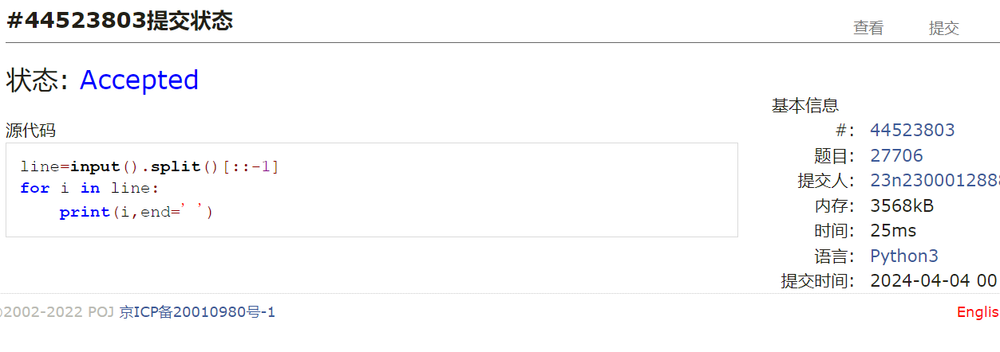
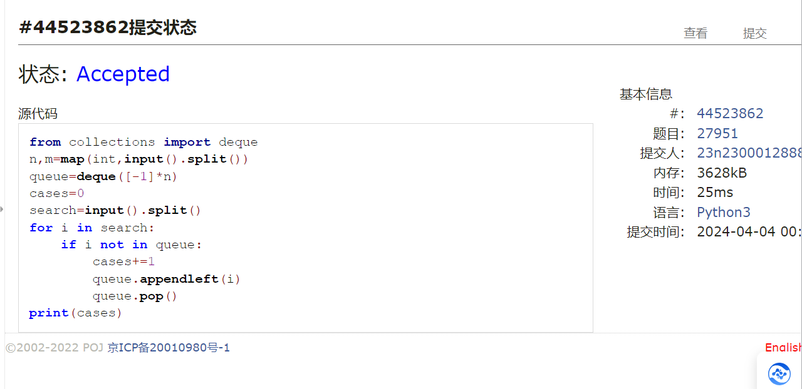
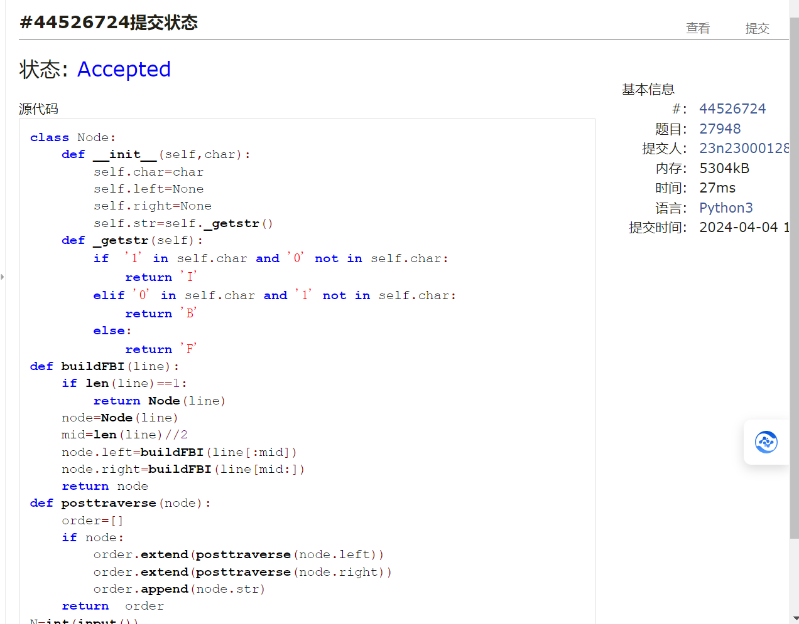
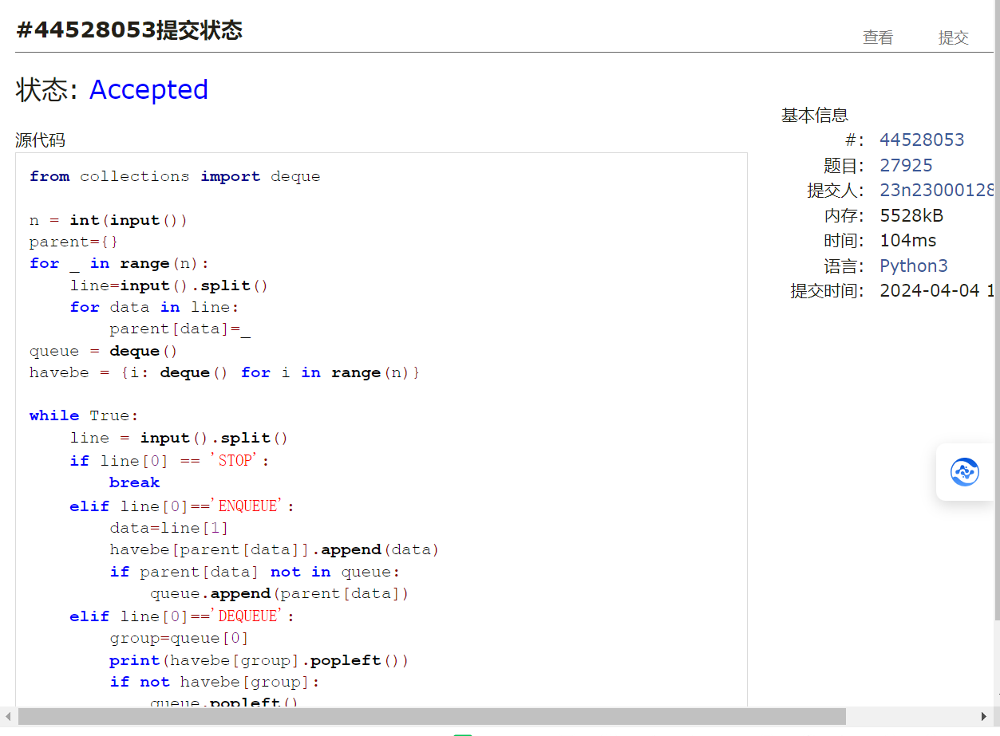
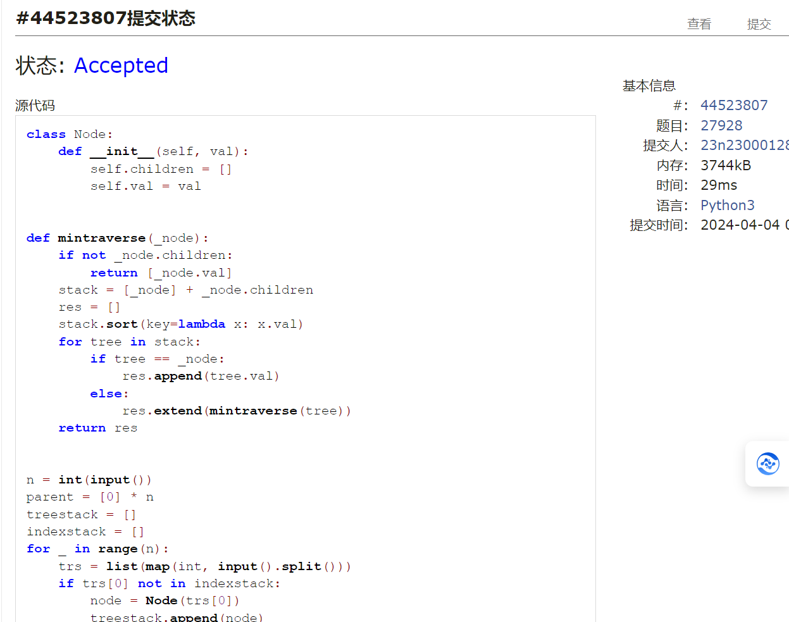

# Assignment #7: April 月考

Updated 1557 GMT+8 Apr 3, 2024

2024 spring, Complied by ==张坤 信息科学技术学院==


**说明：**

1）请把每个题目解题思路（可选），源码Python, 或者C++（已经在Codeforces/Openjudge上AC），截图（包含Accepted），填写到下面作业模版中（推荐使用 typora https://typoraio.cn ，或者用word）。AC 或者没有AC，都请标上每个题目大致花费时间。

2）提交时候先提交pdf文件，再把md或者doc文件上传到右侧“作业评论”。Canvas需要有同学清晰头像、提交文件有pdf、"作业评论"区有上传的md或者doc附件。

3）如果不能在截止前提交作业，请写明原因。


**编程环境**

操作系统： Windows_NT x64 10.0.22631

Python 编程环境：VS code 1.87.2 (user setup)


## 1. 题目

### 27706: 逐词倒放

http://cs101.openjudge.cn/practice/27706/


思路：此题比较简单 用好split即可


代码

```python
line=input().split()[::-1]
for i in line:
    print(i,end=' ')

```


代码运行截图 ==（至少包含有"Accepted"）==




### 27951: 机器翻译

http://cs101.openjudge.cn/practice/27951/


思路：队列的思想


代码

```python
from collections import deque
n,m=map(int,input().split())
queue=deque([-1]*n)
cases=0
search=input().split()
for i in search:
    if i not in queue:
        cases+=1
        queue.appendleft(i)
        queue.pop()
print(cases)

```


代码运行截图 ==（至少包含有"Accepted"）==





### 27932: Less or Equal

http://cs101.openjudge.cn/practice/27932/


思路：这道题要注意两个边界问题，有坑，要仔细读题


代码

```python
datanum = {}
n, k = map(int, input().split())
line = list(map(int, input().split()))
line.sort()
for i in line:
    datanum[i] = datanum[i] + 1 if i in datanum else 1
casenum = 0
if k == 0:
    print(1 if line[0] > 1 else -1)
elif k == n:
    print(line[-1])
else:
    for num, cases in datanum.items():
        casenum += cases
        datanum[num] = casenum
        if casenum < k:
            continue
        elif casenum == k:
            print(num)
            break
        else:
            print(-1)
            break


```


代码运行截图 ==（AC代码截图，至少包含有"Accepted"）==


### 27948: FBI树

http://cs101.openjudge.cn/practice/27948/


思路：建立树结点的类型时加入_getstr()函数，用来的到FBI


代码

```python
class Node:
    def __init__(self,char):
        self.char=char
        self.left=None
        self.right=None
        self.str=self._getstr()
    def _getstr(self):
        if  '1' in self.char and '0' not in self.char:
            return 'I'
        elif '0' in self.char and '1' not in self.char:
            return 'B'
        else:
            return 'F'
def buildFBI(line):
    if len(line)==1:
        return Node(line)
    node=Node(line)
    mid=len(line)//2
    node.left=buildFBI(line[:mid])
    node.right=buildFBI(line[mid:])
    return node
def posttraverse(node):
    order=[]
    if node:
        order.extend(posttraverse(node.left))
        order.extend(posttraverse(node.right))
        order.append(node.str)
    return  order
N=int(input())
line=input()
root=buildFBI(line)
print(''.join(posttraverse(root)))


```



代码运行截图 ==（AC代码截图，至少包含有"Accepted"）==


### 27925: 小组队列

http://cs101.openjudge.cn/practice/27925/


思路：我的做法没有使用set，但是时效时差不多，通过观察我发现，普通的不使用set的方法中，是在每一个集合的字典中存入编号，所以需要增加的时间就是找到每个编号所处集合的时间，而我的做法里反其道行之，用parent字典来对每个编号存入所属集合，效率大大提高


代码

```python
from collections import deque

n = int(input())
parent = {}
for _ in range(n):
    line = input().split()
    for data in line:
        parent[data] = _
queue = deque()
havebe = {i: deque() for i in range(n)}

while True:
    line = input().split()
    if line[0] == 'STOP':
        break
    elif line[0] == 'ENQUEUE':
        data = line[1]
        havebe[parent[data]].append(data)
        if parent[data] not in queue:
            queue.append(parent[data])
    elif line[0] == 'DEQUEUE':
        group = queue[0]
        print(havebe[group].popleft())
        if not havebe[group]:
            queue.popleft()


```



代码运行截图 ==（AC代码截图，至少包含有"Accepted"）==


### 27928: 遍历树

http://cs101.openjudge.cn/practice/27928/


思路：


代码

```python
class Node:
    def __init__(self, val):
        self.children = []
        self.val = val


def mintraverse(_node):
    if not _node.children:
        return [_node.val]
    stack = [_node] + _node.children
    res = []
    stack.sort(key=lambda x: x.val)
    for tree in stack:
        if tree == _node:
            res.append(tree.val)
        else:
            res.extend(mintraverse(tree))
    return res


n = int(input())
parent = [0] * n
treestack = []
indexstack = []
for _ in range(n):
    trs = list(map(int, input().split()))
    if trs[0] not in indexstack:
        node = Node(trs[0])
        treestack.append(node)
        indexstack.append(trs[0])
    else:
        ind = indexstack.index(trs[0])
        node = treestack[ind]
    for i in range(1, len(trs)):
        if trs[i] not in indexstack:
            chnode = Node(trs[i])
            node.children.append(chnode)
            treestack.append(chnode)
            indexstack.append(trs[i])
            parent[len(treestack) - 1] = 1
        else:
            ind = indexstack.index(trs[i])
            node.children.append(treestack[ind])
            parent[ind] = 1
indexroot = parent.index(0)
root = treestack[indexroot]
order = mintraverse(root)
for i in order:
    print(i)


```



代码运行截图 ==（AC代码截图，至少包含有"Accepted"）==


## 2. 学习总结和收获

本次月考能做到ac5，对我我这个刚开始学python的小白已经是天大的喜讯了。、
在做题的过程中，Less or Equal这个题，我第一次做时，没有考虑边界问题，导致我代码运行时间过长，导致超时，我当时没有仔细读题。而小组队列这道题中，我的做题思路其实已经很接近了，但是写代码时逻辑太混乱了，导致出现很多re，想debug也来不及了，所以才没有做出来。


