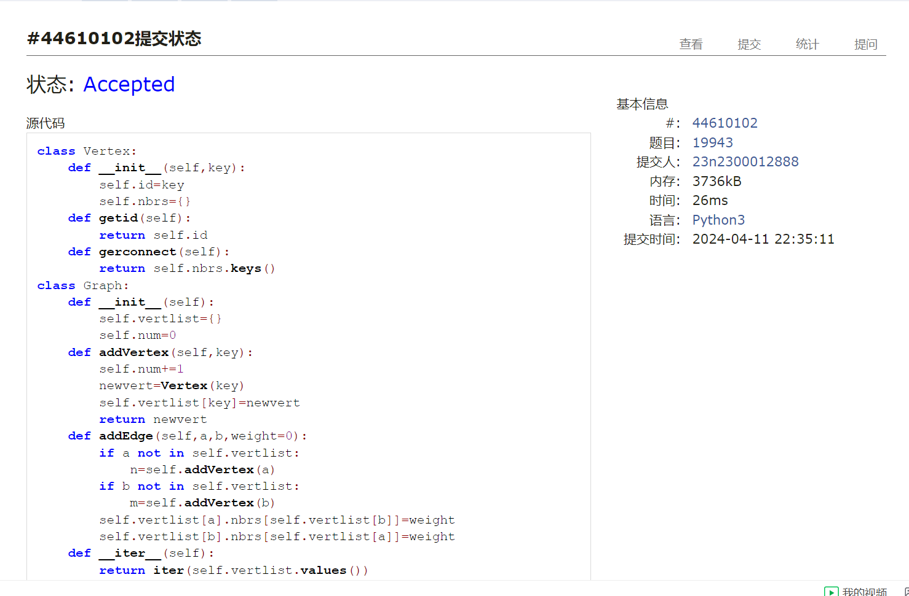
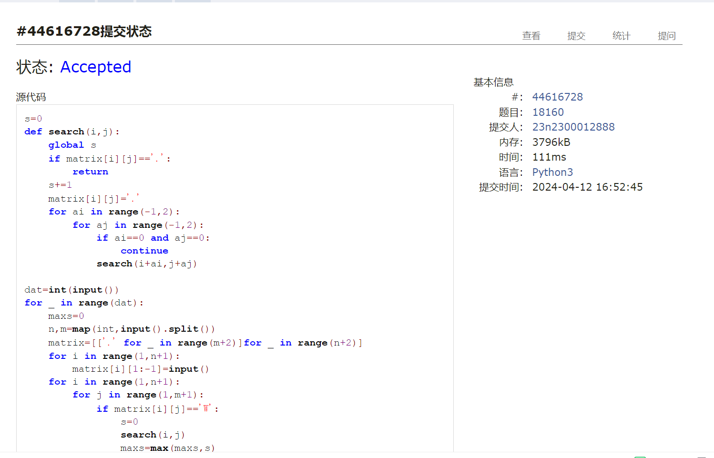
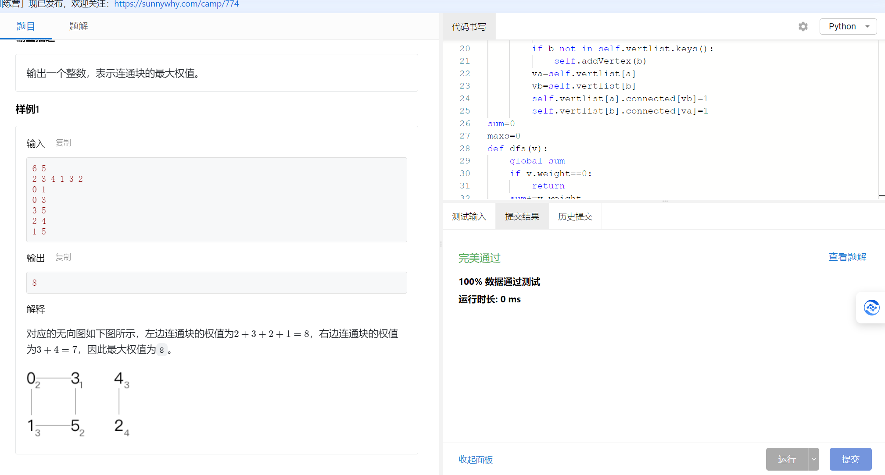
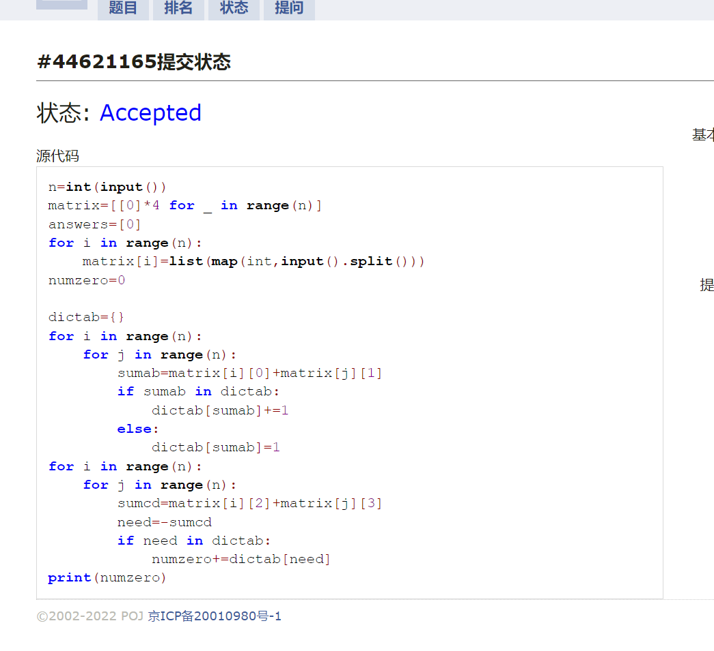
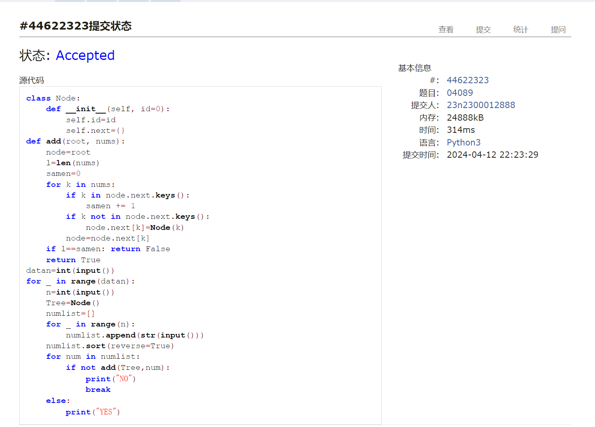
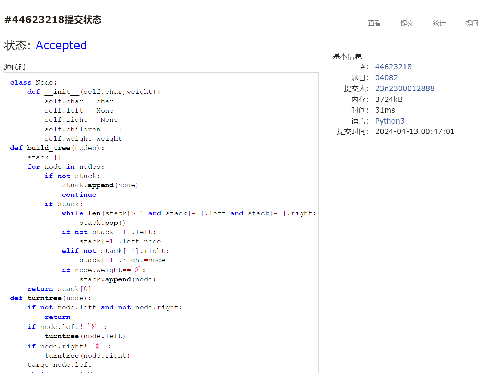

# Assignment #8: 图论：概念、遍历，及 树算

Updated 1919 GMT+8 Apr 8, 2024

2024 spring, Complied by ==张坤 信息科学技术学院==


**说明：**

1）请把每个题目解题思路（可选），源码Python, 或者C++（已经在Codeforces/Openjudge上AC），截图（包含Accepted），填写到下面作业模版中（推荐使用 typora https://typoraio.cn ，或者用word）。AC 或者没有AC，都请标上每个题目大致花费时间。

2）提交时候先提交pdf文件，再把md或者doc文件上传到右侧“作业评论”。Canvas需要有同学清晰头像、提交文件有pdf、"作业评论"区有上传的md或者doc附件。

3）如果不能在截止前提交作业，请写明原因。


**编程环境**

操作系统： Windows_NT x64 10.0.22631

Python 编程环境：VS code 1.87.2 (user setup)


## 1. 题目

### 19943: 图的拉普拉斯矩阵

matrices, http://cs101.openjudge.cn/practice/19943/

请定义Vertex类，Graph类，然后实现


思路：建点建图 建立度


代码

```python
class Vertex:
    def __init__(self,key):
        self.id=key
        self.nbrs={}
    def getid(self):
        return self.id
    def gerconnect(self):
        return self.nbrs.keys()
class Graph:
    def __init__(self):
        self.vertlist={}
        self.num=0
    def addVertex(self,key):
        self.num+=1
        newvert=Vertex(key)
        self.vertlist[key]=newvert
        return newvert
    def addEdge(self,a,b,weight=0):
        if a not in self.vertlist:
            n=self.addVertex(a)
        if b not in self.vertlist:
            m=self.addVertex(b)
        self.vertlist[a].nbrs[self.vertlist[b]]=weight
        self.vertlist[b].nbrs[self.vertlist[a]]=weight
    def __iter__(self):
        return iter(self.vertlist.values())
    
def lapalas(n, edges):
    g = Graph()
    lap = []
    for i in range(n):
        g.addVertex(i)
    for edge in edges:
        g.addEdge(edge[0], edge[1])
        g.addEdge(edge[1], edge[0])
    for vertex in g:
        row = [0] * n
        row[vertex.getid()] = len(vertex.gerconnect())
        for nbr in vertex.gerconnect():
            row[nbr.getid()] = -1
        lap.append(row)
    return lap


n, m = map(int, input().split())
edges = []
for i in range(m):
    a, b = map(int, input().split())
    edges.append((a, b))

laplacianMatrix = lapalas(n, edges)

for row in laplacianMatrix:
    print(' '.join(map(str, row)))


```



代码运行截图 ==（至少包含有"Accepted"）==


### 18160: 最大连通域面积

matrix/dfs similar, http://cs101.openjudge.cn/practice/18160


思路：使用矩阵与dfs，每遍历依次就把点还原


代码

```python
s=0
def search(i,j):
    global s
    if matrix[i][j]=='.':
        return
    s+=1
    matrix[i][j]='.'
    for ai in range(-1,2):
        for aj in range(-1,2):
            if ai==0 and aj==0:
                continue
            search(i+ai,j+aj)
                
dat=int(input())
for _ in range(dat):
    maxs=0
    n,m=map(int,input().split())
    matrix=[['.' for _ in range(m+2)]for _ in range(n+2)]
    for i in range(1,n+1):
        matrix[i][1:-1]=input()
    for i in range(1,n+1):
        for j in range(1,m+1):
            if matrix[i][j]=='W':
                s=0
                search(i,j)
                maxs=max(maxs,s)
    print(maxs)

```



代码运行截图 ==（至少包含有"Accepted"）==


### sy383: 最大权值连通块

https://sunnywhy.com/sfbj/10/3/383


思路：和18160相似 不过换成图


代码

```python
# 
class Vertex:
    def __init__(self,key):
        self.id=key
        self.connected={}
        self.weight=0
    def addweight(self,value):
        self.weight=value
class Graph:
    def __init__(self):
        self.vertlist={}
        self.num=0
    def addVertex(self,key):
        self.num+=1
        newv=Vertex(key)
        self.vertlist[key]=newv
        return newv
    def addEdge(self,a,b):
        if a not in self.vertlist.keys():
            self.addVertex(a)
        if b not in self.vertlist.keys():
            self.addVertex(b)
        va=self.vertlist[a]
        vb=self.vertlist[b]
        self.vertlist[a].connected[vb]=1
        self.vertlist[b].connected[va]=1
sum=0
maxs=0
def dfs(v):
    global sum
    if v.weight==0:
        return
    sum+=v.weight
    v.weight=0
    for nbr in v.connected:
        dfs(nbr)
n,m=map(int,input().split())
g=Graph()
for i in range(n):
    g.addVertex(i)
for i,value in enumerate(input().split()):
    g.vertlist[i].addweight(int(value))
for _ in range(m):
    a,b=map(int,input().split())
    g.addEdge(a,b)
for vertex in g.vertlist.values():
    if vertex.weight!=0:
        sum=0
        dfs(vertex)
        maxs=max(maxs,sum)
print(maxs)
    
```



代码运行截图 ==（AC代码截图，至少包含有"Accepted"）==


### 03441: 4 Values whose Sum is 0

data structure/binary search, http://cs101.openjudge.cn/practice/03441


思路：a+b建立一个字典 计算c+d（注意不建立字典，否则空间不够）找到sum（a+b）的相反数则+1


代码

```python
# 

n=int(input())
matrix=[[0]*4 for _ in range(n)]
answers=[0]
for i in range(n):
    matrix[i]=list(map(int,input().split()))
numzero=0

dictab={}
for i in range(n):
    for j in range(n):
        sumab=matrix[i][0]+matrix[j][1]
        if sumab in dictab:
            dictab[sumab]+=1
        else:
            dictab[sumab]=1
for i in range(n):
    for j in range(n):
        sumcd=matrix[i][2]+matrix[j][3]
        need=-sumcd
        if need in dictab:
            numzero+=dictab[need]
print(numzero)
```



代码运行截图 ==（AC代码截图，至少包含有"Accepted"）==


### 04089: 电话号码

trie, http://cs101.openjudge.cn/practice/04089/

Trie 数据结构可能需要自学下。


思路：Trie数据结构 查找同时建立


代码

```python
# 
class Node:
    def __init__(self, id=0):
        self.id=id
        self.next={}
def add(root, nums):
    node=root
    l=len(nums)
    samen=0
    for k in nums:
        if k in node.next.keys():
            samen += 1
        if k not in node.next.keys():
            node.next[k]=Node(k)
        node=node.next[k]
    if l==samen: return False
    return True
datan=int(input())
for _ in range(datan):
    n=int(input())
    Tree=Node()
    numlist=[]
    for _ in range(n):
        numlist.append(str(input()))
    numlist.sort(reverse=True)
    for num in numlist:
        if not add(Tree,num):
            print("NO")
            break
    else:
        print("YES")

```



代码运行截图 ==（AC代码截图，至少包含有"Accepted"）==


### 04082: 树的镜面映射

http://cs101.openjudge.cn/practice/04082/


思路：先建树 再转化为正常树 BFS时要逆序


代码

```python
# 
class Node:
    def __init__(self,char,weight):
        self.char = char
        self.left = None
        self.right = None
        self.children = []
        self.weight=weight
def build_tree(nodes):
    stack=[]
    for node in nodes:
        if not stack:
            stack.append(node)
            continue
        if stack:
            while len(stack)>=2 and stack[-1].left and stack[-1].right:
                stack.pop()
            if not stack[-1].left:
                stack[-1].left=node
            elif not stack[-1].right:
                stack[-1].right=node
            if node.weight=='0':
                stack.append(node)
    return stack[0]
def turntree(node):
    if not node.left and not node.right:
        return
    if node.left!='$' :
        turntree(node.left)
    if node.right!='$' :
        turntree(node.right)
    targe=node.left
    while  targe!=None:
        if targe.char=='$':
            break
        node.children.append(targe)
        targe=targe.right
def niBFS(root):
    queue=[]
    queue.append(root)
    while queue:
        node=queue.pop(0)
        print(node.char,end=' ')
        for child in node.children[::-1]:
            queue.append(child)
            
n=int(input())
nodes=[Node(o[0],o[1]) for o in input().split()]
root=build_tree(nodes)
turntree(root)
niBFS(root)

    
```


代码运行截图 ==（AC代码截图，至少包含有"Accepted"）==





## 2. 学习总结和收获

1.在练习4 values whose sum is 0一题时对时间复杂度和空间复杂度有了更深的理解，为了节约时间很多时候就会增加空间，而节约空间也有增加时间的可能，对于只需要使用一次的数据，有时不需要存储，可以先计算出来，然后直接用。这样会大大节约空间
2.最大连通域面积与最大权值连通块二题让我体会到矩阵与图的一定相似形，对图理解更深
3.词阶问题是第一次接触桶，感觉很方便的一个数据结构


