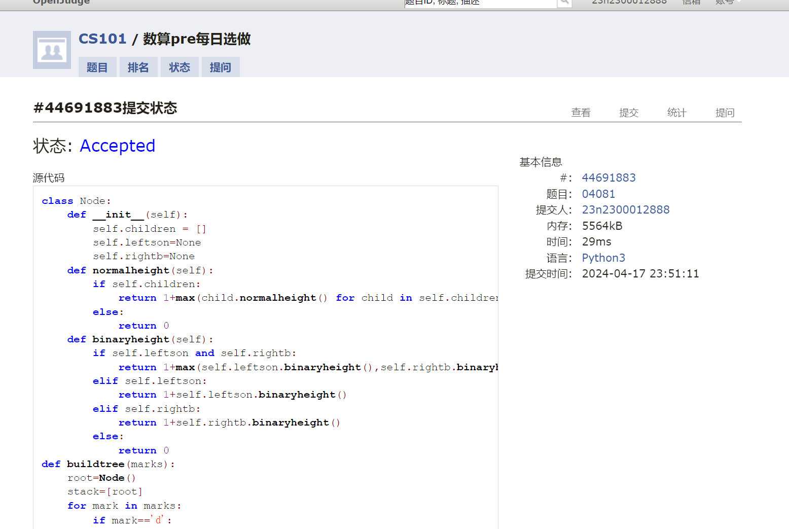
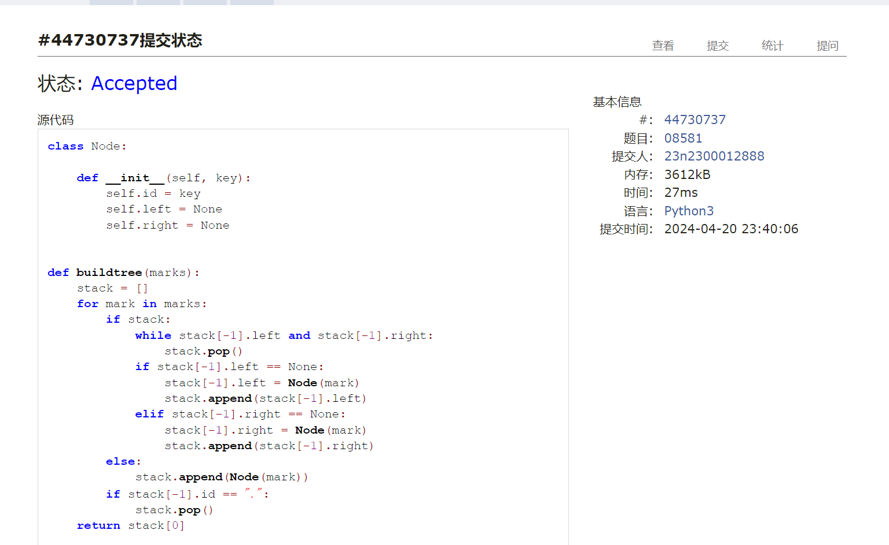
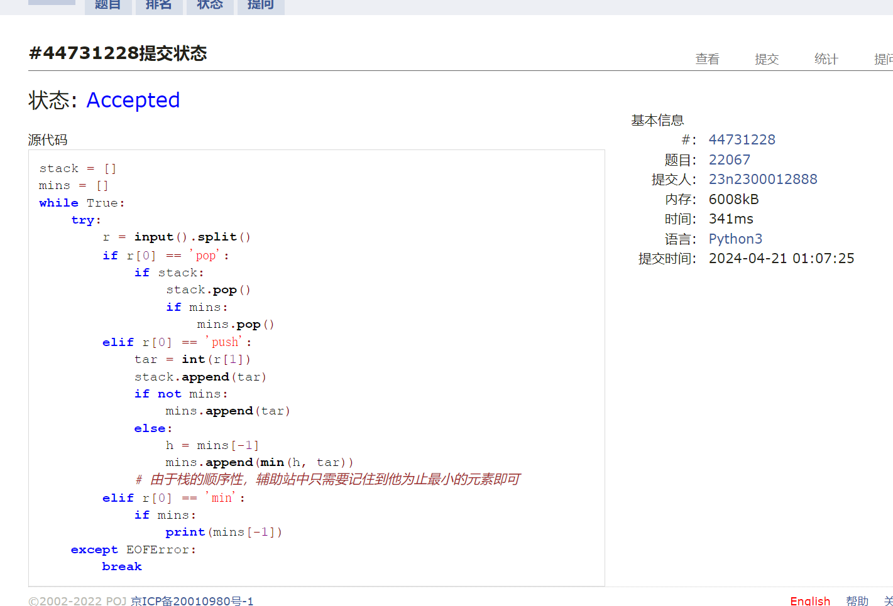
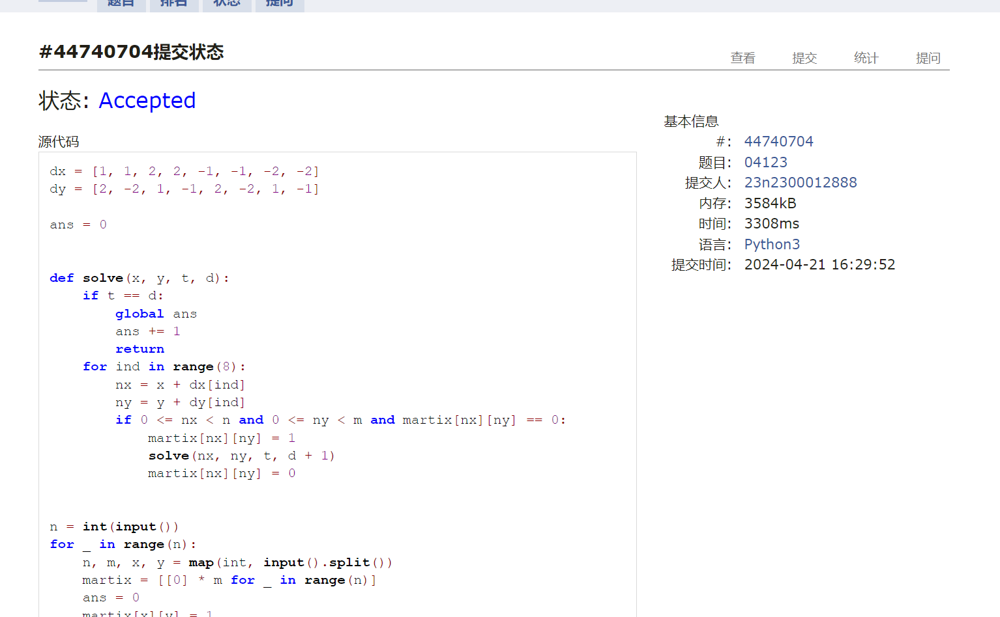
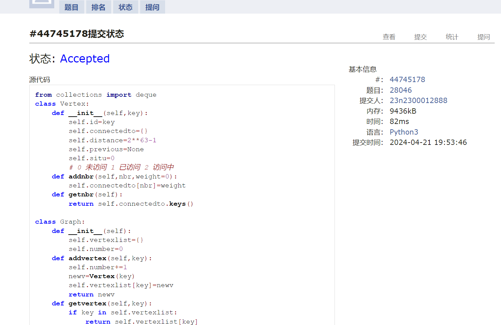
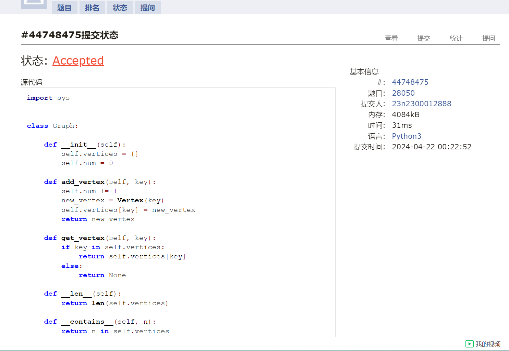

# Assignment #9: 图论：遍历，及 树算

Updated 1739 GMT+8 Apr 14, 2024

2024 spring, Complied by ==张坤 信息科学技术学院==


**说明：**

1）请把每个题目解题思路（可选），源码Python, 或者C++（已经在Codeforces/Openjudge上AC），截图（包含Accepted），填写到下面作业模版中（推荐使用 typora https://typoraio.cn ，或者用word）。AC 或者没有AC，都请标上每个题目大致花费时间。

2）提交时候先提交pdf文件，再把md或者doc文件上传到右侧“作业评论”。Canvas需要有同学清晰头像、提交文件有pdf、"作业评论"区有上传的md或者doc附件。

3）如果不能在截止前提交作业，请写明原因。


**编程环境**

操作系统： Windows_NT x64 10.0.22631

Python 编程环境：VS code 1.87.2 (user setup)


## 1. 题目

### 04081: 树的转换

http://cs101.openjudge.cn/dsapre/04081/


思路：


代码

```python
class Node:
    def __init__(self):
        self.children = []
        self.leftson=None
        self.rightb=None
    def normalheight(self):
        if self.children:
            return 1+max(child.normalheight() for child in self.children)
        else:
            return 0
    def binaryheight(self):
        if self.leftson and self.rightb:
            return 1+max(self.leftson.binaryheight(),self.rightb.binaryheight())
        elif self.leftson:
            return 1+self.leftson.binaryheight()
        elif self.rightb:
            return 1+self.rightb.binaryheight()
        else:
            return 0
def buildtree(marks):
    root=Node()
    stack=[root]
    for mark in marks:
        if mark=='d':
            newnode=Node()
            stack[-1].children.append(newnode)
            stack.append(newnode)
        elif mark=='u':
            stack.pop()
    return stack[0]
def normaltobinary(node):
    if node.children:
        node.leftson=node.children[0]
        for childin in range(len(node.children)):
            if childin ==len(node.children)-1:
                normaltobinary(node.children[childin])
                break
            else:
                node.children[childin].rightb=node.children[childin+1]
                normaltobinary(node.children[childin])
marks=input()
root=buildtree(marks)
normaltobinary(root)
a=root.normalheight()
b=root.binaryheight()
print(f"{a} => {b}")
class Node:
    def __init__(self):
        self.children = []
        self.leftson=None
        self.rightb=None
    def normalheight(self):
        if self.children:
            return 1+max(child.normalheight() for child in self.children)
        else:
            return 0
    def binaryheight(self):
        if self.leftson and self.rightb:
            return 1+max(self.leftson.binaryheight(),self.rightb.binaryheight())
        elif self.leftson:
            return 1+self.leftson.binaryheight()
        elif self.rightb:
            return 1+self.rightb.binaryheight()
        else:
            return 0
def buildtree(marks):
    root=Node()
    stack=[root]
    for mark in marks:
        if mark=='d':
            newnode=Node()
            stack[-1].children.append(newnode)
            stack.append(newnode)
        elif mark=='u':
            stack.pop()
    return stack[0]
def normaltobinary(node):
    if node.children:
        node.leftson=node.children[0]
        for childin in range(len(node.children)):
            if childin ==len(node.children)-1:
                normaltobinary(node.children[childin])
                break
            else:
                node.children[childin].rightb=node.children[childin+1]
                normaltobinary(node.children[childin])
marks=input()
root=buildtree(marks)
normaltobinary(root)
a=root.normalheight()
b=root.binaryheight()
print(f"{a} => {b}")

```



代码运行截图 ==（至少包含有"Accepted"）==


### 08581: 扩展二叉树

http://cs101.openjudge.cn/dsapre/08581/


思路：根据左结点和右节点的存在性去建树


代码

```python
class Node:

    def __init__(self, key):
        self.id = key
        self.left = None
        self.right = None


def buildtree(marks):
    stack = []
    for mark in marks:
        if stack:
            while stack[-1].left and stack[-1].right:
                stack.pop()
            if stack[-1].left == None:
                stack[-1].left = Node(mark)
                stack.append(stack[-1].left)
            elif stack[-1].right == None:
                stack[-1].right = Node(mark)
                stack.append(stack[-1].right)
        else:
            stack.append(Node(mark))
        if stack[-1].id == ".":
            stack.pop()
    return stack[0]


def traverse(node, method):
    if node:
        if method == 'pre' and node.id != '.':
            print(node.id, end='')
        traverse(node.left, method)
        if method == 'in' and node.id != '.':
            print(node.id, end='')
        traverse(node.right, method)
        if method == 'post' and node.id != '.':
            print(node.id, end='')


marks = input()
root = buildtree(marks)
traverse(root, 'in')
print()
traverse(root, 'post')


```



代码运行截图 ==（至少包含有"Accepted"）==


### 22067: 快速堆猪

http://cs101.openjudge.cn/practice/22067/


思路：辅助栈


代码

```python
stack = []
mins = []
while True:
    try:
        r = input().split()
        if r[0] == 'pop':
            if stack:
                stack.pop()
                if mins:
                    mins.pop()
        elif r[0] == 'push':
            tar = int(r[1])
            stack.append(tar)
            if not mins:
                mins.append(tar)
            else:
                h = mins[-1]
                mins.append(min(h, tar))
            # 由于栈的顺序性，辅助站中只需要记住到他为止最小的元素即可
        elif r[0] == 'min':
            if mins:
                print(mins[-1])
    except EOFError:
        break

```



代码运行截图 ==（AC代码截图，至少包含有"Accepted"）==


### 04123: 马走日

dfs, http://cs101.openjudge.cn/practice/04123


思路：dfs


代码

```python
dx = [1, 1, 2, 2, -1, -1, -2, -2]
dy = [2, -2, 1, -1, 2, -2, 1, -1]

ans = 0


def solve(x, y, t, d):
    if t == d:
        global ans
        ans += 1
        return
    for ind in range(8):
        nx = x + dx[ind]
        ny = y + dy[ind]
        if 0 <= nx < n and 0 <= ny < m and martix[nx][ny] == 0:
            martix[nx][ny] = 1
            solve(nx, ny, t, d + 1)
            martix[nx][ny] = 0


n = int(input())
for _ in range(n):
    n, m, x, y = map(int, input().split())
    martix = [[0] * m for _ in range(n)]
    ans = 0
    martix[x][y] = 1
    solve(x, y, n * m, 1)
    print(ans)


```



代码运行截图 ==（AC代码截图，至少包含有"Accepted"）==


### 28046: 词梯

bfs, http://cs101.openjudge.cn/practice/28046/


思路：运用桶去建树 运用color去保存状态


代码

```python
from collections import deque


class Vertex:

    def __init__(self, id):
        self.id = id
        self.connectedto = {}
        self.distance = 2**63 - 1
        self.previous = None
        self.situ = 0
        # 0 未访问 1 已访问 2 访问中
    def addnbr(self, nbr, weight=0):
        self.connectedto[nbr] = weight

    def getnbr(self):
        return self.connectedto.keys()


class Graph:

    def __init__(self):
        self.vertexlist = {}
        self.number = 0

    def addvertex(self, key):
        self.number += 1
        newv = Vertex(key)
        self.vertexlist[key] = newv
        return newv

    def getvertex(self, key):
        if key in self.vertexlist:
            return self.vertexlist[key]
        else:
            return None

    def __len__(self):
        return self.number

    def __contains__(self, n):
        return n in self.vertexlist

    def addedge(self, a, b, weight=0):
        if a not in self.vertexlist:
            nv = self.addvertex(a)
        if b not in self.vertexlist:
            nv = self.addvertex(b)
        self.vertexlist[a].addnbr(self.vertexlist[b], weight)

    def getvertexs(self):
        return list(self.vertexlist.keys())

    def __iter__(self):
        return iter(self.vertexlist.values())


def build_graph(words):
    buckets = {}
    the_graph = Graph()
    for word in words:
        for i, _ in enumerate(word):
            bucket = f"{word[:i]}_{word[i+1:]}"
            buckets.setdefault(bucket, set()).add(word)
    for siw in buckets.values():
        for word1 in siw:
            for word2 in siw - {word1}:
                the_graph.addedge(word1, word2)
    return the_graph


n = int(input())
words = [input() for _ in range(n)]
g = build_graph(words)


def bfs(start):
    start.distance = 0
    start.previous = None
    vque = deque([start])
    while len(vque):
        v = vque.popleft()
        for nbr in v.getnbr():
            if nbr.situ == 0:
                nbr.situ = 2
                nbr.distance = v.distance + 1
                nbr.previous = v
                vque.append(nbr)
        v.situ = 1


def traverse(end):
    ans = []
    current = end
    while (current.previous):
        ans.append(current.id)
        current = current.previous
    ans.append(current.id)
    return ans[::-1]


start, end = input().split()
bfs(g.getvertex(start))
if end in g and g.getvertex(end).situ == 1:
    ans = traverse(g.getvertex(end))
    print(*ans)
else:
    print("NO")


```



代码运行截图 ==（AC代码截图，至少包含有"Accepted"）==


### 28050: 骑士周游

dfs, http://cs101.openjudge.cn/practice/28050/


思路：学习了一个重要的算法，启发式算法


代码

```python
import sys


class Graph:

    def __init__(self):
        self.vertices = {}
        self.num = 0

    def add_vertex(self, key):
        self.num += 1
        new_vertex = Vertex(key)
        self.vertices[key] = new_vertex
        return new_vertex

    def get_vertex(self, key):
        if key in self.vertices:
            return self.vertices[key]
        else:
            return None

    def __len__(self):
        return len(self.vertices)

    def __contains__(self, n):
        return n in self.vertices

    def add_edge(self, f, t, cost=0):
        if f not in self.vertices:
            nv = self.add_vertex(f)
        if t not in self.vertices:
            nv = self.add_vertex(t)
        self.vertices[f].add_neighbor(self.vertices[t], cost)

    def getVertices(self):
        return list(self.vertices.keys())

    def __iter__(self):
        return iter(self.vertices.values())


class Vertex:

    def __init__(self, num):
        self.key = num
        self.connectedTo = {}
        self.color = 'white'
        self.distance = 2**63 - 1
        self.previous = None
        self.disc = 0
        self.fin = 0

    def __lt__(self, o):
        return self.key < o.key

    def add_neighbor(self, nbr, cost=0):
        self.connectedTo[nbr] = cost

    def get_neighbors(self):
        return self.connectedTo.keys()


def knight_graph(board_size):
    kt_graph = Graph()
    for row in range(board_size):
        for col in range(board_size):
            node_id = pos_to_node_id(row, col, board_size)
            new_positions = gen_legal_moves(row, col, board_size)
            for row2, col2 in new_positions:
                other_node_id = pos_to_node_id(row2, col2, board_size)
                kt_graph.add_edge(node_id, other_node_id)
    return kt_graph


def gen_legal_moves(row, col, board_size):
    new_moves = []
    move_offsets = [(-1, -2), (-1, 2), (-2, -1), (-2, 1), (1, -2), (1, 2),
                    (2, 1), (2, -1)]
    for r_off, c_off in move_offsets:
        nr = r_off + row
        nc = c_off + col
        if 0 <= nr < board_size and 0 <= nc < board_size:
            new_moves.append((nr, nc))
    return new_moves


def pos_to_node_id(row, col, board_size):
    return row * board_size + col


def knight_tour(n, path, u, limit):

    u.color = 'gray'
    path.append(u)
    if n < limit:
        neighbors = ordered_by_avail(u)
        for nbr in neighbors:
            if nbr.color == 'white' and knight_tour(n + 1, path, nbr, limit):
                return True
        else:
            path.pop()
            u.color = 'white'
            return False
    else:
        return True


def ordered_by_avail(u):
    res_list = []
    for v in u.get_neighbors():
        if v.color == 'white':
            c = 0
            for w in v.get_neighbors():
                if w.color == 'white':
                    c += 1
            res_list.append((c, v))
    res_list.sort(key=lambda x: x[0])
    return [y[1] for y in res_list]


bdsize = int(input())
*start_pos, = map(int, input().split())
g = knight_graph(bdsize)
start_vertex = g.get_vertex(pos_to_node_id(*start_pos, bdsize))
if start_vertex is None:
    print("fail")
    exit(0)
    
tour_path = []
done = knight_tour(0, tour_path, start_vertex, bdsize*bdsize - 1)
if done:
    print("success")
else:
    print("fail")

exit(0)

```



代码运行截图 ==（AC代码截图，至少包含有"Accepted"）==


## 2. 学习总结和收获

1.词梯问题中再次见识了桶的好处，大大优化了效率
2.快速堆猪中，辅助栈的用法很有灵性
3.骑士周游中的启发式算法很有意思，通过先找旁支末节来优化


