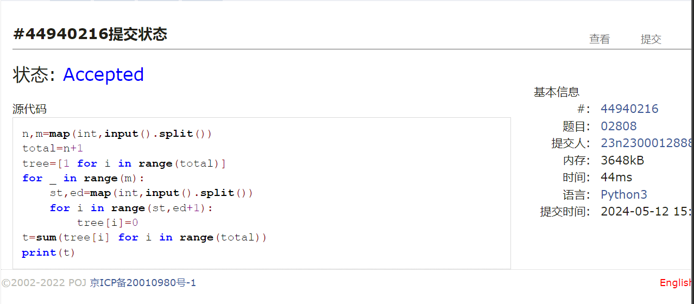
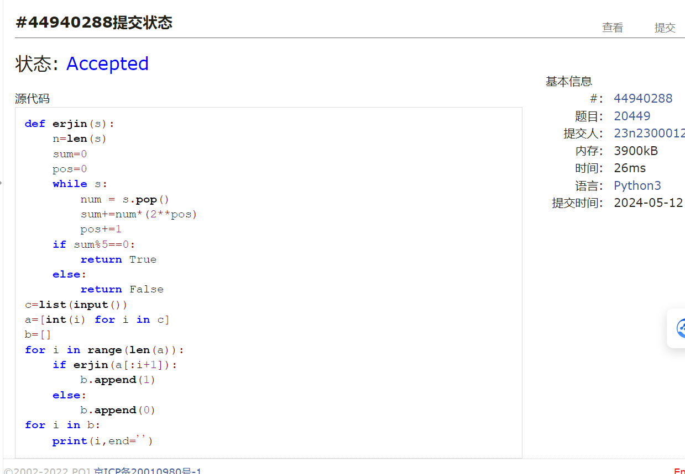
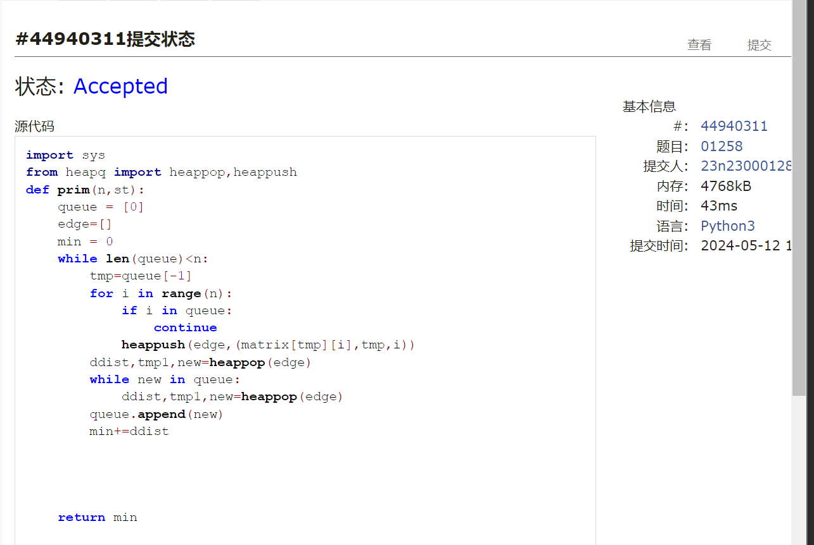
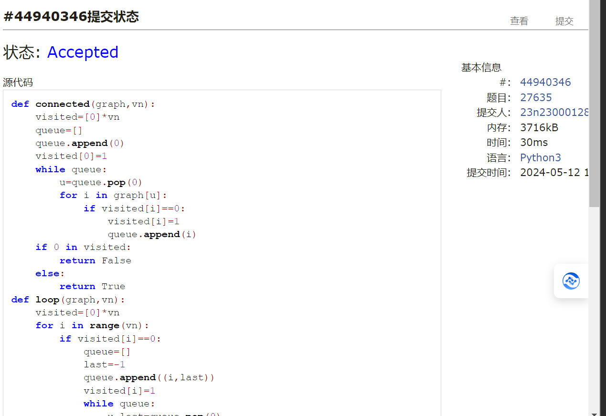
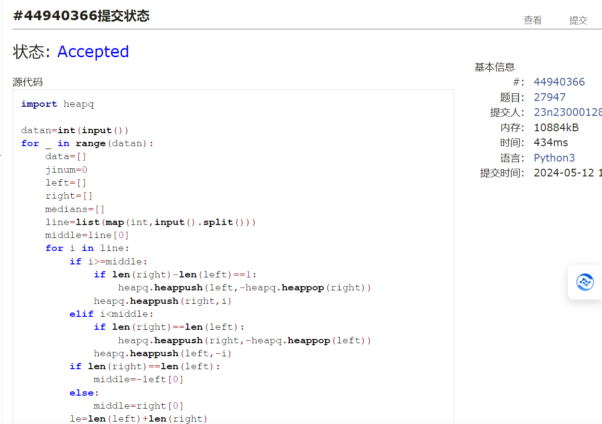
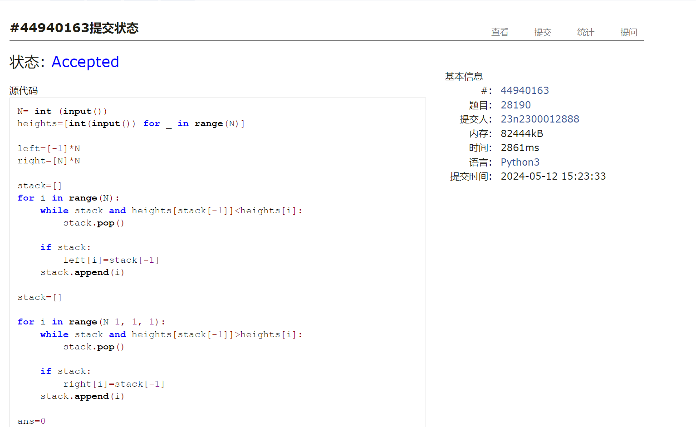

# Assignment #D: May月考

Updated 1654 GMT+8 May 8, 2024

2024 spring, Complied by ==同学的姓名、院系==


**说明：**

1）请把每个题目解题思路（可选），源码Python, 或者C++（已经在Codeforces/Openjudge上AC），截图（包含Accepted），填写到下面作业模版中（推荐使用 typora https://typoraio.cn ，或者用word）。AC 或者没有AC，都请标上每个题目大致花费时间。

2）提交时候先提交pdf文件，再把md或者doc文件上传到右侧“作业评论”。Canvas需要有同学清晰头像、提交文件有pdf、"作业评论"区有上传的md或者doc附件。

3）如果不能在截止前提交作业，请写明原因。


**编程环境**

==（请改为同学的操作系统、编程环境等）==

操作系统：macOS Ventura 13.4.1 (c)

Python编程环境：Spyder IDE 5.2.2, PyCharm 2023.1.4 (Professional Edition)

C/C++编程环境：Mac terminal vi (version 9.0.1424), g++/gcc (Apple clang version 14.0.3, clang-1403.0.22.14.1)


## 1. 题目

### 02808: 校门外的树

http://cs101.openjudge.cn/practice/02808/


思路：


代码

```python
n,m=map(int,input().split())
total=n+1
tree=[1 for i in range(total)]
for _ in range(m):
    st,ed=map(int,input().split())
    for i in range(st,ed+1):
        tree[i]=0
t=sum(tree[i] for i in range(total))
print(t)

```



代码运行截图 ==（至少包含有"Accepted"）==


### 20449: 是否被5整除

http://cs101.openjudge.cn/practice/20449/


思路：


代码

```python
def erjin(s):
    n=len(s)
    sum=0
    pos=0
    while s:
        num = s.pop()
        sum+=num*(2**pos)
        pos+=1
    if sum%5==0:
        return True
    else:
        return False
c=list(input())
a=[int(i) for i in c]
b=[]
for i in range(len(a)):
    if erjin(a[:i+1]):
        b.append(1)
    else:
        b.append(0)
for i in b:
    print(i,end='')


```



代码运行截图 ==（至少包含有"Accepted"）==


### 01258: Agri-Net

http://cs101.openjudge.cn/practice/01258/


思路：


代码

```python
import sys
from heapq import heappop,heappush
def prim(n,st):
    queue = [0]
    edge=[]
    min = 0
    while len(queue)<n:
        tmp=queue[-1]
        for i in range(n):
            if i in queue:
                continue
            heappush(edge,(matrix[tmp][i],tmp,i))
        ddist,tmp1,new=heappop(edge)
        while new in queue:
            ddist,tmp1,new=heappop(edge)
        queue.append(new)
        min+=ddist


    return min

while True:
    try:
        n = int(input())
        matrix = []
        for _ in range(n):
            matrix.append(list(map(int, input().split())))
        distance = sys.maxsize
        distance=prim(n,0)
        print(distance)
    except EOFError:
        break
        


```



代码运行截图 ==（AC代码截图，至少包含有"Accepted"）==


### 27635: 判断无向图是否连通有无回路(同23163)

http://cs101.openjudge.cn/practice/27635/


思路：


代码

```python
def connected(graph,vn):
    visited=[0]*vn
    queue=[]
    queue.append(0)
    visited[0]=1
    while queue:
        u=queue.pop(0)
        for i in graph[u]:
            if visited[i]==0:
                visited[i]=1
                queue.append(i)
    if 0 in visited:
        return False
    else:
        return True
def loop(graph,vn):
    visited=[0]*vn
    for i in range(vn):
        if visited[i]==0:
            queue=[]
            last=-1
            queue.append((i,last))
            visited[i]=1
            while queue:
                u,last=queue.pop(0)
                for j in graph[u]:
                    if visited[j]==0:
                        visited[j]=1
                        queue.append((j,u))
                    elif visited[j]==1:
                        if j!=last:
                            return True
                        else:
                            continue
    return False

vn,en=map(int,input().split())
graph=[[] for i in range(vn)]
for i in range(en):
    a,b=map(int,input().split())
    graph[a].append(b)
    graph[b].append(a)
if connected(graph,vn):
    print("connected:yes")
else:
    print("connected:no")
if loop (graph,vn):
    print("loop:yes")
else:
    print("loop:no")


```



代码运行截图 ==（AC代码截图，至少包含有"Accepted"）==


### 27947: 动态中位数

http://cs101.openjudge.cn/practice/27947/


思路：


代码

```python
import heapq

datan=int(input())
for _ in range(datan):
    data=[]
    jinum=0
    left=[]
    right=[]
    medians=[]
    line=list(map(int,input().split()))
    middle=line[0]
    for i in line:
        if i>=middle:
            if len(right)-len(left)==1:
                heapq.heappush(left,-heapq.heappop(right))
            heapq.heappush(right,i)
        elif i<middle:
            if len(right)==len(left):
                heapq.heappush(right,-heapq.heappop(left))
            heapq.heappush(left,-i)
        if len(right)==len(left):
            middle=-left[0]
        else:
            middle=right[0]
        le=len(left)+len(right)
        if le%2==1:
            jinum+=1
            medians.append(middle)
    print(jinum)
    print(*medians)


```



代码运行截图 ==（AC代码截图，至少包含有"Accepted"）==


### 28190: 奶牛排队

http://cs101.openjudge.cn/practice/28190/


思路：


代码

```python
N= int (input())
heights=[int(input()) for _ in range(N)]

left=[-1]*N
right=[N]*N

stack=[]
for i in range(N):
    while stack and heights[stack[-1]]<heights[i]:
        stack.pop()
    
    if stack:
        left[i]=stack[-1]
    stack.append(i)

stack=[]

for i in range(N-1,-1,-1):
    while stack and heights[stack[-1]]>heights[i]:
        stack.pop()
    
    if stack:
        right[i]=stack[-1]
    stack.append(i)
    
ans=0
for i in range(N):
    for j in range(left[i]+1,i):
        if right[j]>i:
            ans = max(ans,i-j+1)
            break
print(ans)

```



代码运行截图 ==（AC代码截图，至少包含有"Accepted"）==


## 2. 学习总结和收获

==如果作业题目简单，有否额外练习题目，比如：OJ“2024spring每日选做”、CF、LeetCode、洛谷等网站题目。==

1.本次月考稍有进步，达到了接近ac5了（第五题题目条件看错了，考完才发现，改了一下就对了）
2.最小生成树的算法，如果只有bfs会很慢，要改用prim算法（一种贪心算法）


