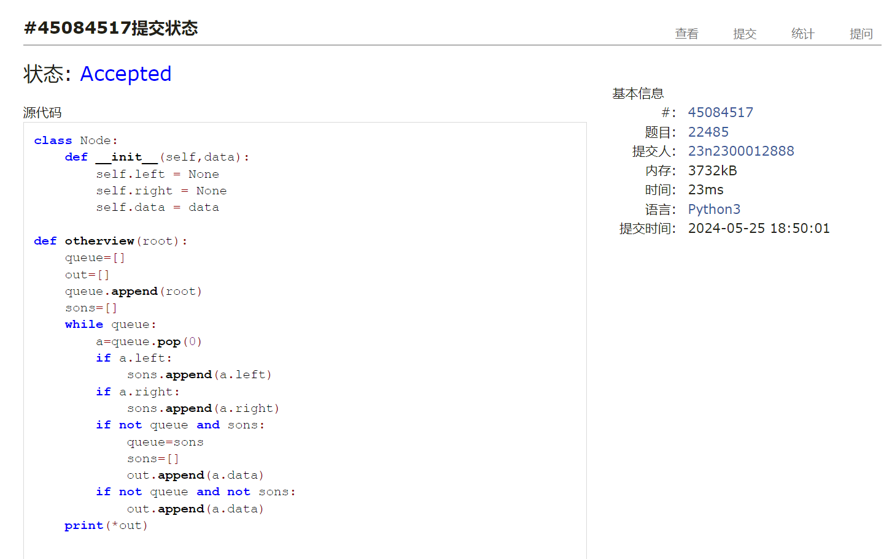
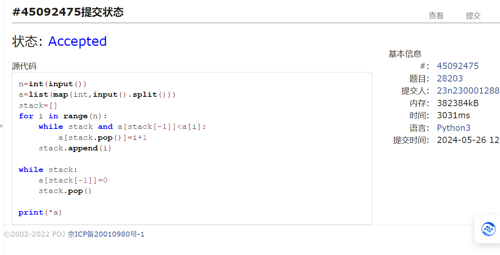
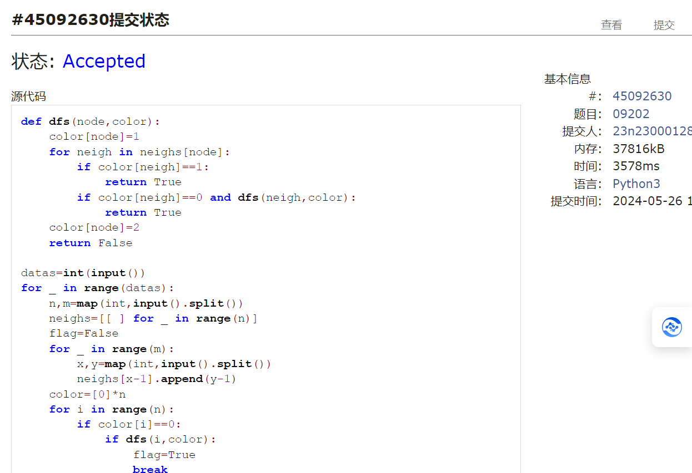
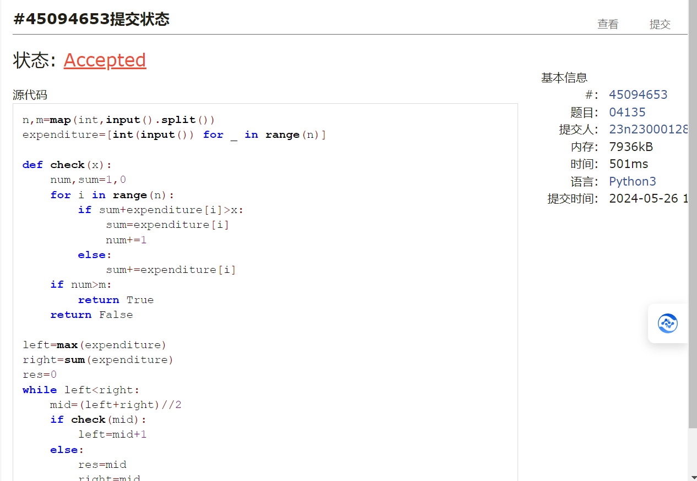
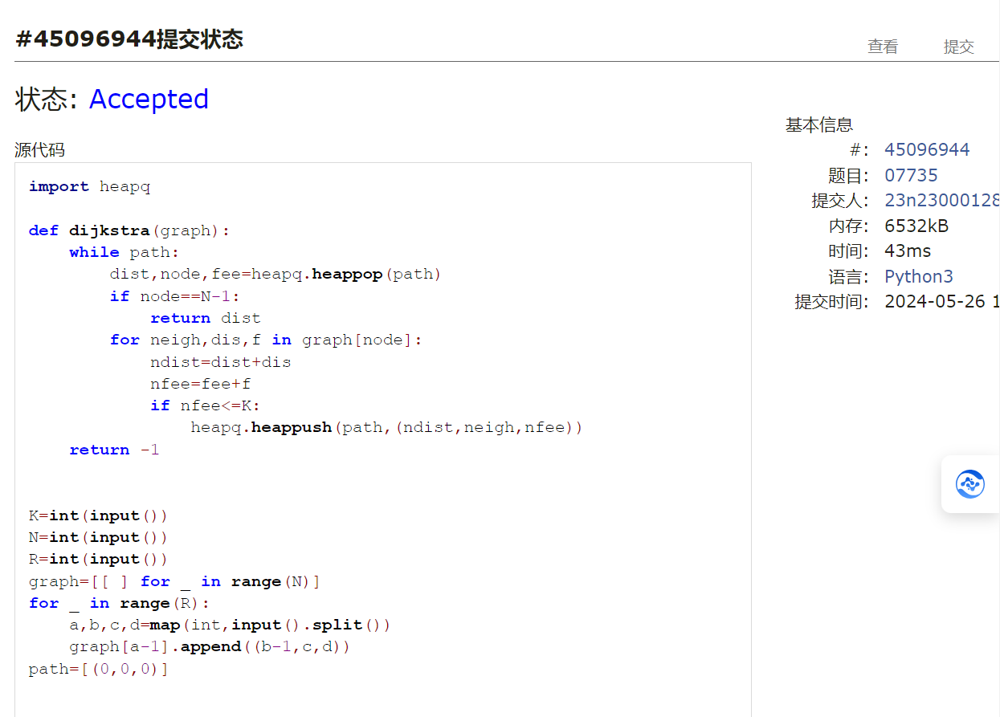
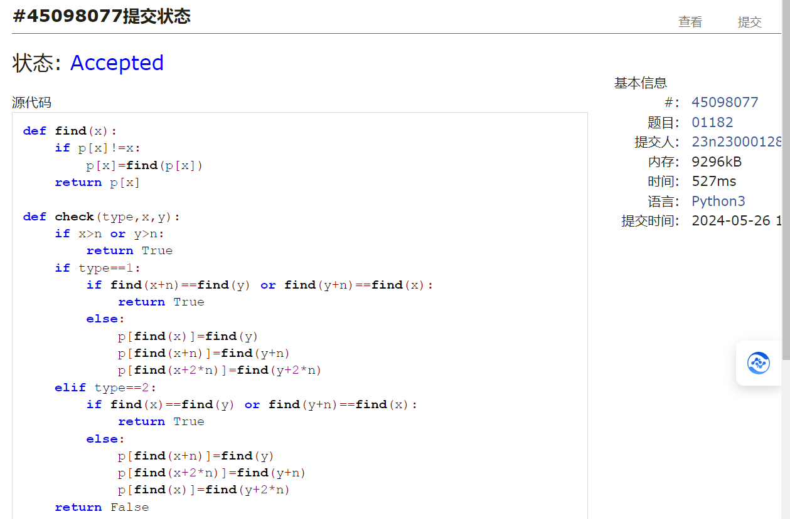

# Assignment #F: All-Killed 满分

Updated 1844 GMT+8 May 20, 2024

2024 spring, Complied by ==张坤 信科学院==


## 1. 题目

### 22485: 升空的焰火，从侧面看

http://cs101.openjudge.cn/practice/22485/


思路：bfs留下每一层最后一个节点


代码

```python
class Node:
    def __init__(self, data):
        self.left = None
        self.right = None
        self.data = data


def otherview(root):
    queue = []
    out = []
    queue.append(root)
    sons = []
    while queue:
        a = queue.pop(0)
        if a.left:
            sons.append(a.left)
        if a.right:
            sons.append(a.right)
        if not queue and sons:
            queue = sons
            sons = []
            out.append(a.data)
        if not queue and not sons:
            out.append(a.data)
    print(*out)


N = int(input())
Nodelist = []
for i in range(N):
    Nodelist.append(Node(i + 1))
for i in range(N):
    left, right = map(int, input().split())
    if left != -1:
        Nodelist[i].left = Nodelist[left - 1]
    if right != -1:
        Nodelist[i].right = Nodelist[right - 1]
otherview(Nodelist[0])


```



代码运行截图 ==（至少包含有"Accepted"）==


### 28203:【模板】单调栈

http://cs101.openjudge.cn/practice/28203/


思路：结合下标的顺序性而产生的栈，先进先出且有单调性


代码

```python
n = int(input())
a = list(map(int, input().split()))
stack = []
for i in range(n):
    while stack and a[stack[-1]] < a[i]:
        a[stack.pop()] = i + 1
    stack.append(i)

while stack:
    a[stack[-1]] = 0
    stack.pop()

print(*a)


```



代码运行截图 ==（至少包含有"Accepted"）==


### 09202: 舰队、海域出击！

http://cs101.openjudge.cn/practice/09202/


思路：dfs结合color函数保证单向图中的单向性不会干扰结构


代码

```python
def dfs(node, color):
    color[node] = 1
    for neigh in neighs[node]:
        if color[neigh] == 1:
            return True
        if color[neigh] == 0 and dfs(neigh, color):
            return True
    color[node] = 2
    return False


datas = int(input())
for _ in range(datas):
    n, m = map(int, input().split())
    neighs = [[] for _ in range(n)]
    flag = False
    for _ in range(m):
        x, y = map(int, input().split())
        neighs[x - 1].append(y - 1)
    color = [0] * n
    for i in range(n):
        if color[i] == 0:
            if dfs(i, color):
                flag = True
                break
    print('Yes' if flag else 'No')


```



代码运行截图 ==（AC代码截图，至少包含有"Accepted"）==


### 04135: 月度开销

http://cs101.openjudge.cn/practice/04135/


思路：二分法的思路


代码

```python
n, m = map(int, input().split())
expenditure = [int(input()) for _ in range(n)]


def check(x):
    num, sum = 1, 0
    for i in range(n):
        if sum + expenditure[i] > x:
            sum = expenditure[i]
            num += 1
        else:
            sum += expenditure[i]
    if num > m:
        return True
    return False


left = max(expenditure)
right = sum(expenditure)
res = 0
while left < right:
    mid = (left + right) // 2
    if check(mid):
        left = mid + 1
    else:
        res = mid
        right = mid
print(res)


```



代码运行截图 ==（AC代码截图，至少包含有"Accepted"）==


### 07735: 道路

http://cs101.openjudge.cn/practice/07735/


思路：dijkstra


代码

```python
import heapq


def dijkstra(graph):
    while path:
        dist, node, fee = heapq.heappop(path)
        if node == N - 1:
            return dist
        for neigh, dis, f in graph[node]:
            ndist = dist + dis
            nfee = fee + f
            if nfee <= K:
                heapq.heappush(path, (ndist, neigh, nfee))
    return -1


K = int(input())
N = int(input())
R = int(input())
graph = [[] for _ in range(N)]
for _ in range(R):
    a, b, c, d = map(int, input().split())
    graph[a - 1].append((b - 1, c, d))
path = [(0, 0, 0)]

res = dijkstra(graph)
print(res)


```



代码运行截图 ==（AC代码截图，至少包含有"Accepted"）==


### 01182: 食物链

http://cs101.openjudge.cn/practice/01182/


思路：并查集，需要注意的是其中的数学逻辑，比如
a吃b且a吃c 那么b与c是同类


代码

```python
def find(x):
    if p[x]!=x:
        p[x]=find(p[x])
    return p[x]

def check(type,x,y):
    if x>n or y>n:
        return True
    if type==1:
        if find(x+n)==find(y) or find(y+n)==find(x):
            return True
        else:
            p[find(x)]=find(y)
            p[find(x+n)]=find(y+n)
            p[find(x+2*n)]=find(y+2*n)
    elif type==2:
        if find(x)==find(y) or find(y+n)==find(x):
            return True
        else:
            p[find(x+n)]=find(y)
            p[find(x+2*n)]=find(y+n)
            p[find(x)]=find(y+2*n)
    return False


n,k=map(int,input().split())
p=[0]*(3*n+1)
for i in range(3*n+1):
    p[i]=i
num=0
for i in range(k):
    type,x,y=map(int,input().split())
    if check(type,x,y):
        num+=1
print(num)


```



代码运行截图 ==（AC代码截图，至少包含有"Accepted"）==


## 2. 学习总结和收获

==如果作业题目简单，有否额外练习题目，比如：OJ“2024spring每日选做”、CF、LeetCode、洛谷等网站题目。==
做了一些选做题，dijkstra掌握的还是不够好
二分查找这道题的思路感觉太完美了，max与sum正好是答案所处的左边界与右边界，再进行二分查找，思路太好了


